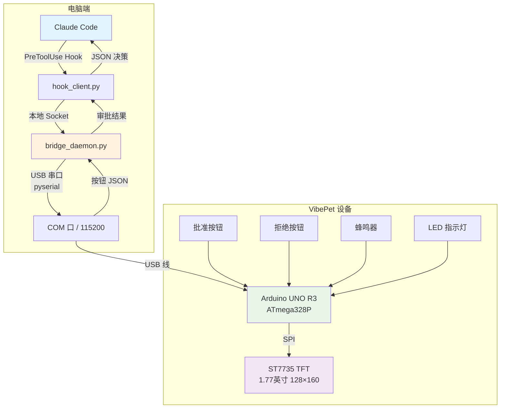
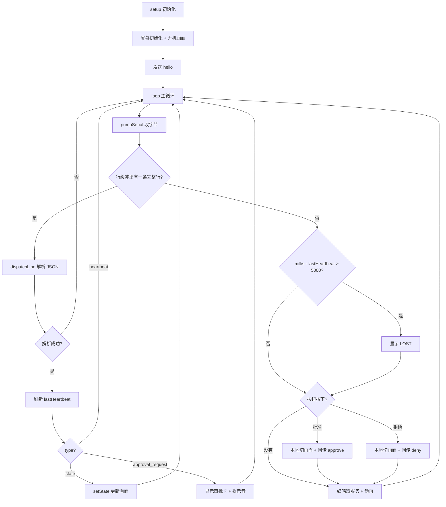
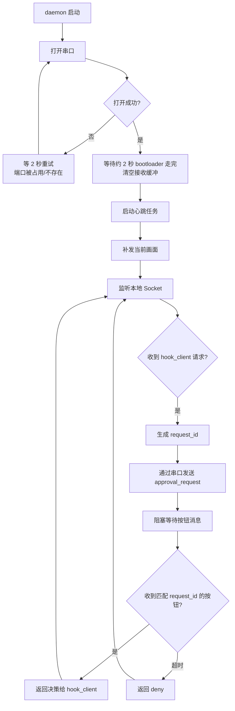

## 一、项目概述

### 1.1 项目名称

**VibePet —— AI 编程助手物理状态显示与审批终端（USB 有线版）**

> **版本说明**：v2.0 为「无线 BLE 版」（ESP32-C3 + NimBLE/NUS）。v3.0 改为
> **Arduino UNO R3 + USB 有线串口**：主控换型、传输层换型、协议上下限收紧，
> 属于破坏性变更，故跳大版本号。v2.0 的 BLE 路线不再维护，其代码与配置已从
> 仓库移除（git 历史中仍可查阅）。
>
> **当前状态（2026-09-25）**：设计已全部实现 —— 固件**编译零警告**（Flash 27636/32256
> 字节、RAM 1282/2048 字节），电脑端四套自动化测试共 44 例、固件端离线测试（协议解析
> + 字库取行）55 例全部通过；UNO R3 + 1.77" 屏的显示链路**已实测点亮**，固件
> **已烧录到设备上运行**（设备复位后会发 `hello`）。
> **尚未做**：屏幕显示内容的实机观感（六态、中文折行、空心方框降级）、按钮回传、
> 看门狗 LOST 与恢复、daemon 端到端，以及本文中标「待实测」的性能数字。

### 1.2 项目背景

Claude Code、Codex CLI 等 AI 编程助手正快速进入开发者工作流。然而，这些工具的状态反馈完全依赖终端窗口——用户必须频繁切换到终端查看 AI 是否完成工作、是否正在等待审批。尤其在 AI 需要批准敏感操作（如执行 `rm` 命令）时，用户需要紧盯屏幕并手动输入确认。

本项目打造一个放在桌面上的实体小设备，**通过一根 USB 线连接电脑**，实时显示 AI 编程助手的工作状态，并提供物理按钮完成 approve / deny 审批，让开发者从“盯终端”中解放出来。

> **为什么从无线改回有线？** v2.0 的 BLE 链路（ESP32-C3 + NimBLE）本身已经跑通：
> 设备正常广播、电脑端能扫到并连接、NUS 服务正常。但同一块屏在同一块板子上
> 始终「背光亮、无画面」，换库、换引脚、换 SPI 速度都没能点亮，判断为接线或
> 模块的物理问题。改用 UNO R3 后，显示链路走仓库里已经验证过编译的
> Adafruit 图形栈（`test-firmware/tfttest_uno`），**且 UNO 的 USB 口天然就是一
> 条串口链路**，不需要蓝牙模块、不需要配对、不需要 AT 配置。代价是设备必须
> 插着线（见 4.1、4.4 与 9.1 的取舍说明）。

### 1.3 项目目标

1. 通过 **USB 串口**接收 Claude Code 的状态事件，在 1.77 英寸 TFT 屏幕（128×160）上显示六种状态提示效果：空闲、工作中、等待审批、完成、出错、失联。
2. 当 AI 发起敏感操作审批请求时，屏幕弹出审批卡，用户按下物理按钮完成 approve / deny，决策通过**同一条串口**回传给电脑端。
3. 具备看门狗失联检测机制，设备不会冻结在过期状态。
4. 电脑端采用常驻守护进程（daemon）管理串口连接、心跳和按钮消息；Claude Code Hook 通过本地 IPC 与 daemon 通信，阻塞等待审批结果。
5. 引入 `request_id` 机制，确保按钮决策与当前审批请求一一对应，避免迟到按钮误批准。
6. **在 2 KB RAM / 32 KB Flash 的 8 位机上显示中文**：自制 12×13 点阵子集字库，把完整 GB2312 字库裁到设备真正用得到的几百字。

### 1.4 创新点与竞赛亮点

- **AI Agent 与嵌入式硬件的物理联动**：将 AI 编程助手的 Hook 机制与硬件结合，实现“物理审批”交互范式。
- **8 位机上的中文渲染**：ATmega328P 只有 2 KB RAM、32 KB Flash，而完整的中文点阵字库要 200 KB —— 本项目自建字库裁剪工具链，从 U8g2 的文泉驿点阵宋体里抠出约 400 个字，编码成 20 字节/字的紧凑格式（详见 5.8）。
- **零第三方 JSON 依赖的协议解析**：不引入 ArduinoJson（在 AVR 上 Flash 与堆都吃不消），自写约 120 行的字段提取器，含转义、`\uXXXX`、嵌套与 UTF-8 边界截断（详见 5.4 与 5.5）。
- **不会丢包的单任务协作式调度**：所有连续推屏操作切片到 ≤ 3 ms，主循环与渲染循环之间穿插串口泵，保证 2 KB RAM + 128 字节硬件缓冲下也不丢行（详见 5.6、5.7）。
- **阻塞式审批 + 超时降级**：审批阻塞等待决定，超时自动拒绝，保证安全性。
- **看门狗失联保护**：设备永远不会冻结在过期状态，心跳超时后自动切换到失联显示。
- **request_id 匹配机制**：按钮回传携带请求编号，电脑端只接受当前等待中的请求，避免误批准。

## 二、需求分析

### 2.1 功能需求

| 编号 | 功能 | 描述 | 优先级 |
|---|---|---|---|
| F1 | 六种状态显示 | 屏幕显示空闲、工作中、等待审批、完成、出错、失联六种状态，每种有对应的颜色、文字和简单动画 | 高 |
| F2 | 审批提示 | AI 发起敏感操作审批请求时，屏幕弹出审批卡，显示工具名称和命令摘要（中文可读） | 高 |
| F3 | 物理审批 | 用户按下“批准”或“拒绝”按钮，设备通过串口回传带 `request_id` 的决策 | 高 |
| F4 | 超时降级 | 审批等待超过设定时间（默认 120 秒），自动返回“拒绝” | 高 |
| F5 | 心跳检测 | 电脑端 daemon 每秒发送心跳包，设备超时未收到则显示“失联” | 中 |
| F6 | 蜂鸣器提醒 | 进入“等待审批”状态时，蜂鸣器发出短促提示音 | 中 |
| F7 | 串口连接管理 | daemon 自动发现并打开串口、断线自动重连，设备端 LED 指示链路状态 | 高 |
| F8 | request_id 匹配 | 按钮回传携带 `request_id`，电脑端只接受当前等待中的请求 | 高 |
| F9 | 单审批队列 | 同一时间只处理一个审批请求，简化第一版实现 | 中 |

### 2.2 性能指标

| 指标 | 目标值 | 说明 |
|---|---|---|
| 状态刷新延迟 | ≤ 300 ms | 从 daemon 发出到屏幕更新完成（整屏切片重绘约 25–60 ms），待实测 |
| 按钮响应延迟 | ≤ 200 ms | 从按钮按下到串口发出（含去抖窗口），待实测 |
| 链路可用时间 | ≤ 3 s | 从 daemon 启动到串口可用。**打开串口会使 UNO 复位**，须等 bootloader 走完约 2 s（见 5.4），待实测 |
| 审批超时时间 | 120 s（可配置） | 超时后自动拒绝 |
| 心跳超时时间 | 5 s（可配置） | 超时后进入失联显示 |
| 连续工作稳定性 | ≥ 8 小时 | 待实测 |

### 2.3 约束条件

| 约束项 | 要求 |
|---|---|
| 成本 | 核心 BOM ≤ ¥100（不含外壳和 3D 打印费用） |
| 尺寸 | 设备主体尺寸待定 —— 需按实际采购的 UNO 板与屏幕模块外形实测后填写 |
| 供电 | **必须由 USB 供电**（数据链路与供电是同一条线），不支持电池独立工作 |
| 通信方式 | USB 串口（CDC），115200 8N1，JSON Lines |
| 开发环境 | Arduino IDE ≥ 2.3 或 arduino-cli，`arduino:avr` 核心 ≥ 1.8.6 |
| 资源上限 | Flash 32256 字节、SRAM 2048 字节 —— 这是本项目一切设计取舍的前提 |

## 三、系统总体设计

### 3.1 硬件架构框图



**工作流**：Claude Code 触发 `PreToolUse` Hook → 调用 `hook_client.py` → 客户端通过本地 Socket 向常驻 `bridge_daemon.py` 发送审批请求 → daemon 通过 USB 串口向 UNO 发送状态和 `request_id` → 屏幕显示审批卡 + 蜂鸣器提示 → 用户按按钮 → UNO 通过串口回传带 `request_id` 的按钮 JSON → daemon 校验 `request_id` 后，将决策返回给 `hook_client.py` → 客户端输出 `allow` / `deny` JSON 给 Claude Code。

### 3.2 软件架构框图

```
┌─────────────────────────────────────────────────────────┐
│                    电脑端（Python）                      │
│  ┌───────────────┐        ┌───────────────────────────┐ │
│  │ hook_client.py│◄──────►│ bridge_daemon.py          │ │
│  │ (短生命周期)   │ Socket │ (常驻进程)                │ │
│  └───────────────┘        │  ┌─────────────────────┐  │ │
│         │                 │  │ 串口连接管理         │  │ │
│         │                 │  │ 心跳发送             │  │ │
│         ▼                 │  │ 按钮消息接收         │  │ │
│  ┌───────────────┐        │  │ request_id 校验      │  │ │
│  │ Claude Code   │        │  │ 审批等待队列         │  │ │
│  │ Hook 输出     │        │  └─────────────────────┘  │ │
│  └───────────────┘        └───────────────────────────┘ │
└─────────────────────────────────────────────────────────┘
                          │ USB 串口 115200
┌─────────────────────────────────────────────────────────┐
│              UNO R3 固件（Arduino，单任务协作式）         │
│  ┌───────────┐  ┌───────────┐  ┌───────────────────┐   │
│  │ 串口泵     │→│ 字段提取   │→│ 显示驱动层         │   │
│  │ pumpSerial │  │ jsonScan  │  │ Adafruit_ST7735   │   │
│  └───────────┘  └───────────┘  └───────────────────┘   │
│  ┌───────────┐  ┌───────────┐  ┌───────────────────┐   │
│  │ 按钮扫描   │→│ 拼 JSON    │→│ 串口发送           │   │
│  │digitalRead │  │ 零拷贝     │  │ Serial.print(F(…)) │   │
│  └───────────┘  └───────────┘  └───────────────────┘   │
│  ┌───────────┐  ┌───────────┐  ┌───────────────────┐   │
│  │ 看门狗     │  │ 蜂鸣器     │  │ 中文字库           │   │
│  │(millis计时)│  │ 非阻塞状态机│  │ cn_font.h (子集)   │   │
│  └───────────┘  └───────────┘  └───────────────────┘   │
└─────────────────────────────────────────────────────────┘
```

### 3.3 通信方式与协议

采用 **USB 串口**（UNO 的 D0/D1，经板载 USB 转串口芯片枚举为 COM 口）承载 **JSON Lines** 格式数据，每条消息以 `\n` 结尾，波特率 **115200 8N1**。

> **与 v2.0 的差别**：v2.0 用 BLE Nordic UART Service（NUS）当透明串口，需要协商 MTU、需要三个 UUID、需要处理分片。v3.0 直接用真串口，**UUID 与 MTU 的概念整体消失**，但「一条消息一行、接收端按 `\n` 重组」的规矩保留 —— 串口的字节流同样不保证一次读全一条消息。

**电脑 → 设备**：

```json
{"type":"state","status":"working","msg":"正在分析代码..."}
{"type":"approval_request","request_id":"abc123","tool":"Bash","summary":"rm -rf /tmp/build"}
{"type":"heartbeat","seq":12345}
```

**设备 → 电脑**：

```json
{"type":"button","request_id":"abc123","action":"approve"}
{"type":"button","request_id":"abc123","action":"deny"}
{"type":"hello","fw":"uno/1.0"}
```

> **`hello` 是 v3.0 新增的开机问候**。设备每次复位（上电、按复位键、**电脑端打开串口导致的自动复位**、重新烧录）后都会发一条。daemon 收到它就补发当前应有的画面，避免屏幕停在开机画面上。旧实现（v2.0）没有这条消息，靠的是「断线后重连补发」，而复位并不会断开串口，所以探测不到。

**状态定义**：

| 状态值 | 含义 | 显示颜色 | 屏幕效果 |
|---|---|---|---|
| `idle` | 空闲 | 白色 | 呼吸圆点 + “IDLE” |
| `working` | 工作中 | 绿色 | 旋转方块 + “WORKING” |
| `needs_you` | 等待审批 | 黄色 | 闪烁边框 + “APPROVE?” + 命令摘要 |
| `done` | 完成 | 青色 | 对勾图标 + “DONE” |
| `error` | 出错 | 红色 | 叉号 + “ERROR” + 错误信息 |
| `heartbeat_lost` | 失联 | 橙色 | “LOST” 大字 |

**行长与编码约定（两端硬契约）**：

- 每条消息一行，以 `\n` 结尾；接收端必须按 `\n` 重组（串口读取不保证边界对齐）。
- 整行 UTF-8 编码后**不得超过 320 字节**（固件 `LINE_MAX`）。超长行由设备端**整条丢弃**（丢弃到行尾再复位，不会把半截报文当消息处理）。
- 电脑端据此限制：单字段（`summary` / `msg`）≤ **160 字节**（约 53 个汉字），`tool` 字段 ≤ **24 字节**。截断必须落在 UTF-8 字符边界上（daemon 的 `clamp_bytes()`），保证中文摘要不被截成乱码。
- **为什么是 320 而不是更小**：一条 `approval_request` 的固定开销（`{"type":"approval_request","request_id":"…","tool":"…","summary":"…"}` 的骨架）约 66 字节，加上 8 字节 `request_id`、24 字节 `tool`、160 字节 `summary`，最坏情况正好 258 字节；若上限收到 256，带长工具名（如 `mcp__github__create_issue`，25 字符）的请求会被**整条静默丢弃** —— 屏幕空白、120 秒后超时拒绝，而电脑端全程不知道。留出余量取 320。
- 电脑端只发 `idle` / `working` / `done` / `error` 四种 `status`；`needs_you` 由 `approval_request` 触发、`heartbeat_lost` 由设备端看门狗自行判断，都不出现在 `state` 消息里。

## 四、硬件设计与选型

### 4.1 主控芯片

| 项目 | 内容 |
|---|---|
| **选用型号** | Arduino UNO R3（ATmega328P，官方板或兼容板） |
| **替代方案** | Arduino Nano（V3，同芯片，面包板更省地方，接法与 FQBN 需相应改动）；**不推荐**其他 5V AVR 板之外的型号（见下方取舍） |
| **选型理由** | ① USB 口天然就是串口链路，**不需要任何无线模块**即可与电脑双向通信；② 5V 逻辑、引脚耐操，面包板接线不易损坏；③ 生态与教学资料最丰富，答辩时评委一眼能看懂；④ 仓库里已有可编译的 UNO + ST7735 显示范例 |
| **关键参数** | ATmega328P，16 MHz AVR，**32 KB Flash（可用 32256 字节）/ 2 KB SRAM**，14 路数字 IO + 6 路模拟输入，硬件 SPI 固定在 D11/D12/D13 |

> **必须知道的代价（写在这里，不藏在后面）**：
> 1. **设备必须插着 USB 线工作**。供电与数据是同一条线，v2.0 的「无线/电池」卖点在这个版本里没有了。
> 2. **中文只能显示子集**。完整 GB2312 点阵字库约 200 KB，是全部 Flash 的 6 倍，只能裁到约 400 字（见 5.8）。
> 3. **没有 FreeRTOS、没有 DMA、没有 FPU**。所有并发靠单任务协作式调度（见 5.6），所有动画用整数运算，禁用 `String` / `ArduinoJson` / `malloc`。
> 4. **打开串口会让板子复位**（USB 转串口芯片拉 DTR），因此 daemon 必须在连接后等待约 2 秒再认为链路可用（见 5.4）。
> 5. **烧录时必须先停掉 daemon**，否则串口被占用，上传会失败。
>
> 若这些代价不可接受，可选的技术路线是 **ESP32-C3 保留、只把 NimBLE 换成 USB CDC**（Flash 与 RAM 立刻宽裕、中文可全量保留），但那需要先解决 v2.0 遗留的屏幕不亮问题。本项目选择 UNO 是为了让显示链路走已验证的库与接法。

### 4.2 显示屏

| 项目 | 内容 |
|---|---|
| **推荐型号** | 1.77" ST7735S TFT SPI（128×160） |
| **替代方案** | 1.44" ST7735S SPI（128×128）/ 1.8" ST7735 SPI（128×160） |
| **选型理由** | SPI 接口接线简单；128×160 的横屏画布为 160×128，足够放下「标题 + 图标 + 多行中文摘要」 |
| **驱动库** | **Adafruit_GFX（≥1.11）+ Adafruit ST7735 and ST7789 Library（≥1.10）** —— 经 Arduino 库管理器安装 |
| **初始化序列** | `INITR_BLACKTAB`（黑排/绿排 1.77" 模块的常见变体）。花屏、偏色、白屏时依次换 `INITR_GREENTAB` / `INITR_REDTAB` 试 |
| **中文字体** | **自制子集字库**（`firmware/VibePet_UNO/cn_font.h`，随仓库提交）：从 U8g2 的文泉驿点阵宋体 12px 裁出 **390 字**（95 个 ASCII + 295 个汉字），12×13 点阵、每字 20 字节位图，约 9 KB Flash。详见 5.8 |
| **参考价** | 待按实际采购模块核实 |

> **为什么不用 TFT_eSPI + U8g2？** v2.0 用的是 TFT_eSPI（仓库自带补丁副本）+ U8g2_for_TFT_eSPI 渲染全量中文字库。这条路在 UNO 上走不通：① 仓库自带的 TFT_eSPI 只含 ESP32/ESP8266/RP2040/STM32 后端，**没有 AVR 后端**；② U8g2 的 `wqy12_t_gb2312` 单字体数组就有 202690 字节，装不进 32 KB。换成 Adafruit 栈 + 自制子集字库后，显示链路与字库体积都落到 UNO 能承受的范围。

> **画布尺寸**：`tft.setRotation(1)` 得到的横屏画布是 **160×128**。屏幕物理分辨率为 128×160（竖屏），旋转后坐标原点在左上、x 向右为 0–159、y 向下为 0–127。

> **中文显示**：正文（命令摘要 / 错误信息 / 状态副标题）用自制 12px 字库渲染；标题类大字（IDLE / WORKING / APPROVE? 等）用 Adafruit_GFX 内置 5×7 字体放大 2 倍（10×14），两种字形混排时按同一基线对齐。ASCII 字符同样走自制字库（同一张表里含 0x20–0x7E），**全屏只有一套绘制路径**。

**接线**：屏幕的 8 根线怎么接，见 **4.7.2 接线表**；引脚为何这样分配见 4.7.1。接线只此一处权威，本节不再重复列一遍，免得日后两处打架。

### 4.3 按钮与蜂鸣器

| 模块 | 推荐型号 | 接口 | 选型理由 |
|---|---|---|---|
| 批准按钮 | 6×6 mm 微动开关 | **D2** | `INPUT_PULLUP`，按下读到 LOW |
| 拒绝按钮 | 6×6 mm 微动开关 | **D3** | 同上 |
| 蜂鸣器 | 无源蜂鸣器（2 脚，直接接 IO） | **D4** | 须方波驱动（AVR 的 `tone()` 用 Timer2），成本约 ¥5 |
| LED 指示灯 | 3 mm LED + 限流电阻 | **D5** | 链路状态指示（心跳正常时点亮） |

> **选型澄清：「无源」与「低电平触发」不可兼得。** 「低电平触发」是**有源**蜂鸣器模块
> （内部自带振荡源）的特性——给恒定电平就发声，才有触发极性可言；无源蜂鸣器内部没有
> 振荡源，必须由 IO 输出方波才出声，给恒定直流只会听到一声「咔哒」。本方案选无源，
> 固件对应 `BUZZER_ACTIVE 0`。

> **UNO 没有 strapping 启动脚**。v2.0 花了不少篇幅讲「避开 GPIO9/GPIO8、按住按钮上电会不会进下载模式」——那是 ESP32-C3 特有的问题，在 UNO 上**整段不存在**。UNO 上唯一需要注意的是：**D0/D1 是 USB 数据链路，任何时候都不能接外设**。

### 4.4 电源方案

**唯一方案：USB 供电**

整机由一根 USB 线供电（5V），同时这根线就是数据链路。板上 5V 来自 USB，3.3V 由板载 LDO（LP2985）提供。

**两条必须记住的电气约束**：

1. **UNO R3 的 3.3V 引脚官方标称最大输出 50 mA**。1.77" 模块的背光常超过这个值 —— 从 3.3V 给整块屏供电是**白屏/掉电复位最常见的原因**。若屏幕点不亮或表现为背光亮一下又灭，先按 4.7.2 的方案 B 把屏的 VCC 改到 5V（仅限模块自带 LDO 与电平转换的情况）。
2. **UNO 是 5V 逻辑，而多数 1.77" 模块的逻辑是 3.3V**。带串联电阻的模块可以直接接（`test-firmware/tfttest_uno` 就是这么用的）；如果模块是纯 3.3V 输入且接上后发热或显示异常，需要在 SCK/MOSI/CS/DC/RES 上加电平转换或串联 100–470 Ω 电阻。

**不支持电池供电**：设备必须与电脑有线相连才有数据，独立供电没有意义（v2.0 的锂电池方案在本版作废）。

### 4.5 外围电路要点

- **去耦电容**：屏幕模块的 VCC 与 GND 之间就近放 100 nF（模块通常自带，不必额外加）。
- **背光限流**：若模块的 LEDA 未内置限流电阻，串一只 100 Ω（5V 供电时约 20 mA）。
- **按钮去抖**：软件时间戳去抖（200 ms）已足够；若环境干扰大，可在按钮两端并联 100 nF 电容。
- **蜂鸣器限流（可选）**：无源蜂鸣器直连 IO 时，方波峰值电流可达 30–40 mA，接近 ATmega328P 单脚 40 mA 的绝对上限。若遇到音量异常或引脚发热，在蜂鸣器与 IO 之间串一只 100 Ω 电阻。
- **上电时序**：屏幕的 VCC 与 UNO 共用一条 3.3V/5V 轨，上电即点亮背光，无需额外处理。

### 4.6 硬件清单与成本

| 模块 | 推荐型号 | 用途 | 参考价 |
|---|---|---|---|
| 主控 | Arduino UNO R3（或兼容板） | 核心，串口 + 显示控制 | ¥30~60 |
| 显示屏 | 1.77" ST7735S TFT（128×160） | 六种状态 + 审批卡 | 待核实 |
| 按钮 | 6×6mm 微动开关 ×2 | 批准 / 拒绝 | ¥2 |
| 蜂鸣器 | 无源蜂鸣器（2 脚） | 审批提醒音 | ¥5 |
| LED | 3mm LED + 电阻 | 链路状态指示 | ¥1 |
| 连接 | 杜邦线 + 面包板 | 接线调试 | ¥10 |
| 数据线 | **USB-A/B 方口线（支持数据传输）** | 供电 + 数据 + 烧录 | 自备 |
| **合计** | | | **待核实**（换主控后需按实际采购价重算） |

### 4.7 完整接线指南

> 本节是**接线的唯一权威依据**。4.2 只讲屏幕选型、4.3 只讲选型与引脚分配；全部外设的完整接法、接线顺序与上电前检查项都在本节。引脚定义若与别处冲突，以本节为准。

#### 4.7.1 引脚占用总览

| 引脚 | 用途 | 接线要点 |
|---|---|---|
| **D0 (RX)** | USB 串口数据（收） | **绝对禁止接任何外设** —— 这是设备与电脑之间唯一的数据链路 |
| **D1 (TX)** | USB 串口数据（发） | 同上 |
| **D2** | 批准按钮 | 按钮一端接此脚、另一端接 GND；启用 `INPUT_PULLUP`，按下读到 LOW |
| **D3** | 拒绝按钮 | 同批准按钮 |
| **D4** | 蜂鸣器 | **无源**蜂鸣器，靠方波驱动（固件 `BUZZER_ACTIVE 0`），空闲保持低电平 |
| **D5** | 状态 LED | 串 220 Ω 限流电阻（5V 下约 10 mA），LED 长脚（正极）朝 D5 |
| **D8** | TFT RES / RST | 复位 |
| **D9** | TFT A0 / DC / RS | 数据 / 命令切换 |
| **D10** | TFT CS | 片选 |
| **D11** | TFT SDA / MOSI | **硬件 SPI 固定引脚** |
| **D13** | TFT SCK / SCL | **硬件 SPI 固定引脚**。板载 LED 也接在 D13，屏幕刷新时会看到它闪烁 —— 这是正常的，不要拿它当状态灯 |
| 3.3V | TFT VCC、TFT LED / LEDA | 屏幕电源与背光（背光常亮，不占 IO）。**注意 4.4 的 50 mA 限制** |
| GND | 公共地 | 所有外设的第二根线最终都回到这里 |

**建议空置的引脚**（接线时不要顺手接上去）：

| 引脚 | 说明 |
|---|---|
| D6 / D7 | 预留（未使用） |
| A0–A3 | 预留：可作为额外的数字 IO 使用 |
| A4 / A5 | 预留：板载 I2C 引脚（SCL/SDA），留给以后扩展 |
| D12 | 硬件 SPI 的 MISO。本项目的屏幕是只写设备，**不需要接** |

#### 4.7.2 接线表

**显示屏（1.77" ST7735S，8 线）**

先按**方案 A**接（与仓库里 `test-firmware/tfttest_uno` 一致，已验证可编译）：

| ST7735S 丝印 | UNO | 说明 |
|---|---|---|
| VCC | 3.3V | 屏幕电源（方案 A） |
| GND | GND | 公共地 |
| CS | D10 | 片选 |
| SDA（部分模块标 MOSI） | D11 | SPI 数据 |
| SCK（部分模块标 SCL） | D13 | SPI 时钟 |
| A0（部分模块标 DC 或 RS） | D9 | 数据 / 命令切换 |
| RES（部分模块标 RST） | D8 | 复位 |
| LED（部分模块标 BL 或 LEDA） | 3.3V | 背光常亮；本方案不做软件调光 |

> **⚠️ 若屏幕点不亮或白屏，按顺序试这两个方案**：
>
> | 现象 | 改法 |
> |---|---|
> | 背光亮、无画面；或亮一下又灭（疑似掉电复位） | **方案 B**：把模块 VCC 从 3.3V 改接 **5V**（仅限模块自带 LDO 的型号，多数 1.77" 模块都有）。背光 LEDA 可留在 3.3V 或一并改 5V（视模块是否有背光限流电阻） |
> | 花屏 / 偏色 / 画面偏移 | 不是接线问题，是**初始化序列**不对：改固件里 `INITR_BLACKTAB` 为 `INITR_GREENTAB` / `INITR_REDTAB` 逐个试（见 4.2） |
> | 完全无反应、模块发热 | 模块是纯 3.3V 逻辑却被 5V 驱动输入：给 SCK/MOSI/CS/DC/RES 加电平转换或串 100–470 Ω 电阻 |

> **丝印对不上怎么办**：这块屏有**两种名字、一根引脚**的情况，别当成两根脚去找——
> `A0` / `DC` / `RS` 都是**数据 / 命令切换脚**（Register Select：低电平送命令、高电平送数据），
> 接 D9；`LED` / `BL` / `LEDA` 都是**背光正极**，接 3.3V。
> 若模块上另有 `LEDK` 脚（少见），那是背光负极，接 GND。

**按钮、蜂鸣器、指示灯**

| 元件 | 第一根线 | 第二根线 |
|---|---|---|
| 批准按钮 | D2 | GND |
| 拒绝按钮 | D3 | GND |
| 蜂鸣器 | D4（＋ / 长脚） | GND |
| 状态 LED | 220 Ω 电阻的一端接 D5，另一端接 LED 长脚（正极） | LED 短脚（负极）接 GND |

> 6×6 mm 微动开关是 4 脚器件，**同侧两脚内部相通**。要跨对角接（一侧接 IO、对角接 GND），按下才导通；接成同侧两脚等于一直按着。
> 无源蜂鸣器接反通常也能响（只是相位相反），按 ＋/− 标记接更稳妥。供电方案见 4.4。

#### 4.7.3 接线拓扑

```text
       Arduino UNO R3              1.77" ST7735S TFT
       ──────────────              ─────────────────
          3V3 ─────────────────────── VCC     （点不亮就改 5V，见 4.7.2 方案 B）
          GND ─────────────────────── GND
          D10 ─────────────────────── CS
          D11 ─────────────────────── SDA (MOSI)
          D13 ─────────────────────── SCK
           D9 ─────────────────────── A0 (DC/RS)
           D8 ─────────────────────── RES
          3V3 ─────────────────────── LED / LEDA（背光，常亮）

       Arduino UNO R3              其余外设
       ──────────────              ────────
           D4 ─────────────────────── 蜂鸣器 ＋（－ 接 GND）
           D2 ─────────────────────── 批准按钮（另一端接 GND）
           D3 ─────────────────────── 拒绝按钮（另一端接 GND）
           D5 ──── 220Ω ── LED ────── GND

       （D0/D1 接 USB 线到电脑，不接任何外设）
```

#### 4.7.4 接线顺序

按 8.3 的自底向上顺序接，每一步都能单独验证，不要一次接完再上电：

| 步骤 | 接什么 | 接完怎么验证 |
|---|---|---|
| 1 | 两条电源轨（3.3V / GND）与 TFT 的 8 根线 | 烧录 `test-firmware/tfttest_uno`，屏幕应显示轮播的 AI 图标。白屏先查 4.7.2 的两个方案 |
| 2 | 串口链路（其实不用接，USB 线本身就是） | 烧录 `test-firmware/uno_link`，用串口监视器应看到以 115200 打印的心跳行，**且不乱码**（乱码 = 板子的实际主频与编译设置不符，见 5.1） |
| 3 | 两个按钮 | 万用表通断档：不按不通、按下导通。上电后按键，串口应打印按钮日志 |
| 4 | 蜂鸣器与状态 LED | 上电应听到提示音、LED 点亮；进入 `needs_you` 时能听到提示音 |

#### 4.7.5 上电前检查清单

- [ ] 5V（或 3.3V）与 GND 之间**不短路**（万用表确认）
- [ ] **D0 / D1 上没有任何外设**
- [ ] 屏幕的 VCC 接法已选定（方案 A 3.3V / 方案 B 5V，见 4.7.2）
- [ ] 蜂鸣器确实是**无源**的（固件顶部 `BUZZER_ACTIVE` 默认 `0` 即无源；若手头是有源模块，改回 `1`）
- [ ] D13 上的板载 LED 会随屏幕刷新闪烁，**这是正常现象**，不要去"修"它
- [ ] USB 线支持数据传输（纯充电线枚举不出串口）
- [ ] 准备开始调试前，**先确认没有别的程序占着串口**（Arduino IDE 的串口监视器、另一个 daemon、串口助手都要关掉）

## 五、软件设计与实现

### 5.1 开发环境与工具链

| 项目 | 工具 |
|---|---|
| 嵌入式开发 | Arduino IDE ≥ 2.3 或 arduino-cli（本机实测 1.5.1） |
| AVR 核心 | **`arduino:avr` ≥ 1.8.6**（本机实测 1.8.8）；开发板选 `Arduino Uno`，FQBN = `arduino:avr:uno` |
| 图形库 | Adafruit GFX Library ≥ 1.11 + Adafruit ST7735 and ST7789 Library ≥ 1.10（库管理器安装） |
| 中文字库 | 自制（见 5.8），**已随仓库提交**，日常编译不需要 Python |
| 电脑端开发 | Python ≥ 3.9 + pyserial ≥ 3.5 + asyncio（本机实测 3.5） |
| 电脑端平台 | Windows / macOS / Linux |

**关键编译参数**：

```bash
# 编译（含把串口接收缓冲从默认的 64 字节提到 256 字节 —— 见 5.7 的 RAM 预算）
"$CLI" compile --fqbn arduino:avr:uno \
  --build-property "build.extra_flags=-DSERIAL_RX_BUFFER_SIZE=256" \
  --build-path firmware/VibePet_UNO/build \
  firmware/VibePet_UNO
```

> **`-DSERIAL_RX_BUFFER_SIZE=256` 不能省**。AVR 的 `HardwareSerial` 默认只有 64 字节接收环形缓冲，而一条审批请求最长 320 字节；配合 5.6 的「连续阻塞 ≤ 3 ms」规则，256 字节能提供约 22 ms 的容错窗口。

> **⚠️ `--build-path` 也不能省 —— 否则上面那条 `-D` 会静默失效。**
> 编译器会缓存核心库（`HardwareSerial` 等）的编译产物，而**这份缓存的键不包含
> `build.extra_flags`**：用默认临时目录编译时会命中一份没带标志的旧缓存，
> `SERIAL_RX_BUFFER_SIZE` 悄悄退回默认的 64，编译不报错、行为变差。
> 判据是编译输出里的 RAM 数字：带标志应为 **1282 字节**，若是 **1090** 就说明没生效。

> **用 Arduino IDE 烧录也完全可以。** 本项目没有 v2.0 那种「必须命令行」的限制
> （那时要 `--libraries` 指向自带库），IDE 的上传按钮可用。唯一差别是那条 `-D`
> 在 IDE 里没有对应的设置项，接收缓冲会是默认的 **64 字节** —— 按 5.6 的
> 「连续阻塞 ≤ 3 ms」纪律，屏幕上最费时的一次绘制最多攒下约 29 字节，64 够用，
> 而且缓冲小反而给栈多留了 192 字节（958 对 766）。两条路都可行。

> **主频必须与实物一致**。`arduino:avr:uno` 假定 **16 MHz** 晶振。如果手上的板子实际是 8 MHz（罕见，多见于 3.3V 改版或自制板），编译配置必须改成 `arduino:avr:pro:cpu=8MHzatmega328`，否则串口波特率会整体偏一半 —— **每个字节都是乱码，链路完全不通**。判断方法：烧录 `test-firmware/uno_link` 后看串口输出是否可读。

### 5.2 模块划分与功能说明

**电脑端 bridge_daemon.py（常驻进程）**：

| 模块 | 功能 |
|---|---|
| `SerialTransport` 类 | 打开/关闭串口、后台线程收数据、按 `\n` 重组、断线检测与重连 |
| `Bridge` 类 | 审批逻辑核心：状态去重记账、审批单槽、request_id 校验、重连补发 |
| `send_state()` | 发送状态 JSON（带去重：同一状态不重复发） |
| `send_approval_request()` | 发送带 `request_id` 的审批请求（`tool` / `summary` 按字节截断） |
| `heartbeat_loop()` | 每秒发送心跳包 |
| `_on_device_line()` | 解析设备上行消息，校验 `request_id` 后放行决策；识别 `hello` 触发补发 |
| `wait_for_button()` | 异步阻塞等待按钮，超时返回 `deny` |
| `connection_loop()` | 未连接时每 2 秒重试打开串口；连上后自动补发当前画面 |
| `clamp_bytes()` | 按 UTF-8 边界截断字段，不切碎汉字 |

**电脑端 hook_client.py（短生命周期）**：

| 模块 | 功能 |
|---|---|
| `main()` | 读取 Hook stdin JSON，通过本地 Socket 向 daemon 发送审批请求，等待结果，输出 `allow` / `deny` JSON |
| 异常兜底 | 连接失败、超时、解析失败时返回 `deny`，避免 Hook 崩溃 |
| 状态上报路径 | 其余 Hook 事件映射成状态上报，1 秒超时、失败静默、stdout 零输出 |

**UNO 端 VibePet_UNO.ino**：

| 模块 | 功能 |
|---|---|
| `setup()` | 初始化串口、IO、屏幕，画出开机画面，发送 `hello` |
| `loop()` | 主循环：串口泵 → 派发行 → 看门狗 → 按钮扫描 → 蜂鸣器服务 → 动画 |
| `pumpSerial()` | **只把到达的字节收进行缓冲，不派发**（可在渲染中途安全调用） |
| `dispatchLine()` | 解析并处理一条完整行（状态 / 审批请求 / 心跳） |
| `jsonScan()` / `jsonKeyIs()` | 自写的极简 JSON 字段提取（含转义与 UTF-8 截断） |
| `renderState()` / `updateAnimation()` | 六种状态绘制与逐帧动画（全部切片，见 5.6） |
| `drawText()` / `drawCJKGlyph()` / `cnFontFind()` | 12px 子集字库渲染（ASCII 与汉字同一路径） |
| `checkWatchdog()` | 心跳超时切换失联显示，恢复时回到最后有效状态 |
| `scanButtons()` | 时间戳去抖 + 本地立即切画面 + 回传带 `request_id` 的按钮 JSON |
| `beepStart()` / `beepService()` | 非阻塞蜂鸣器状态机 |

### 5.3 主程序流程图

**UNO 端**：



**电脑端 daemon**：



### 5.4 关键算法与逻辑说明

**（1）request_id 匹配机制**

daemon 为每次审批请求生成唯一 `request_id`（如 UUID 前 8 位），通过串口发送给设备。设备在按钮回传时携带该 `request_id`。daemon 只接受当前等待中的 `request_id`，忽略迟到或过期的按钮事件，避免误批准。设备端同样作废：收到 `state` 消息时清空、按下按钮后立即清空、进入 LOST 时清空。

**（2）打开串口会让板子复位（v3.0 新增的关键约束）**

USB 转串口芯片在端口被打开时会给 ATmega328P 的 RESET 脚一个脉冲，板子会重新跑一遍 bootloader（约 1.5–2 秒），之后才进入我们的固件。后果有两条：

1. 这 2 秒内我们发出的字节会被 bootloader 当作 STK500 烧录命令吃掉；
2. 设备重新跑 `setup()`，屏幕回到开机画面。

因此 `SerialTransport` 在打开端口后设一个 **boot grace（约 2 秒）**：这段时间内 `connected` 返回 `False`，于是 daemon 现成的「刚连上 → 补发当前画面」逻辑会自动生效，屏幕不会卡在开机画面。此外设备每次复位都会发一条 `hello`，daemon 收到后也会补发一次 —— 两条保险覆盖「设备单独复位但端口没断」的情况（比如按了板上的复位键）。

**（3）看门狗失联检测**

设备维护 `lastHeartbeat` 时间戳，**每次收到完整且合法的一行 JSON 时更新**（不只是心跳包）。主循环检查 `millis() - lastHeartbeat > WATCHDOG_TIMEOUT`（默认 5000 ms），超时则切换到橙色 “LOST” 显示。daemon 每秒发送心跳包，确保超时前刷新。

进入 LOST 时设备会作废当前审批请求（清空 `request_id`），失联期间按键不再回传。**心跳恢复后的显示策略**：设备切回失联前的最后有效状态（`lastValidState`）；若那是 `needs_you`（审批卡），则改切 `idle` —— 该请求可能已被电脑端判超时，显示过期卡片会误导用户按下无效按钮。

**（4）按钮去抖与本地立即反馈**

每个按钮维护 `lastPressTime`，当检测到 `digitalRead() == LOW` 且距上次按下超过 `DEBOUNCE_MS`（200 ms）时，才视为有效按下。

按下有效按钮后，设备**先本地切画面**（批准 → `working` + “已批准”；拒绝 → `idle` + “已拒绝”），同时作废 `request_id`，等电脑端后续状态覆盖。脱离 APPROVE? 不依赖电脑端回话，串口抖动时不会卡住，长按也不会重复发送。

**（5）心跳双重身份：保活 + 探活**

daemon 每秒发一次心跳，既是给设备的保活信号，也是 daemon 自己的**链路探针**：串口在物理拔线后，Windows 上并不会立刻报错，只有真正写失败（或读异常）才能确定掉线。心跳让「写」每秒发生一次，掉线最多 1 秒后就会被发现并触发重连。

**（6）六种状态提示效果**

- `idle`：白色呼吸圆点，半径按整数三角波变化（AVR 无 FPU，不用 sin）。
- `working`：绿色旋转方块，角度按帧数递增（整数）。
- `needs_you`：黄色边框闪烁，每 500 ms 切换边框颜色；显示命令摘要。
- `done`：青色对勾图标，静态显示。
- `error`：红色叉号，静态显示；显示错误信息。
- `heartbeat_lost`：橙色背景，黑色 “LOST” 大字。

### 5.5 核心代码片段

> ⚠️ **本节是设计节选，用于说明算法骨架，不是逐行可编译的完整实现。** 完整且经过编译验证的
> 实现是 `firmware/VibePet_UNO/` 与 `pc/` 下的代码；两者若有差异，**以仓库代码为准**，并以
> 本节所述算法为解释。v2.0 的教训是：文档里的示例片段若不写明「这是片段」，读者会照抄并
> 踩坑（缺断线重连、缺并发保护、缺超时）。

**（1）串口泵 + 行重组（设备端，含 3 ms 阻塞预算）**

```cpp
// 只收字节，不派发 —— 这样在渲染中途也能安全调用
void pumpSerial() {
  while (Serial.available()) {
    char c = (char)Serial.read();
    if (c == '\n') {
      if (!dropping) { rxLine[rxLen] = '\0'; lineReady = true; }  // 交主循环派发
      dropping = false;
      rxLen = 0;
    } else if (!dropping) {
      if (rxLen < LINE_MAX - 1) rxLine[rxLen++] = c;
      else { dropping = true; rxLen = 0; }   // 超长：整条丢弃到行尾
    }
  }
}
```

关键点：**接收与派发分离**。派发（可能触发整屏重绘）只发生在主循环里，避免重入；
而只要在渲染的每一小片之间调用 `pumpSerial()`，硬件环形缓冲就不会溢出。

**（2）字段提取（设备端，不依赖 ArduinoJson）**

```cpp
struct JsonSink { char *buf; size_t cap; size_t len; };  // buf[len] 恒为 '\0'

// 取字符串字段，含反转义；写满时回退到最后一个完整 UTF-8 序列（不切碎汉字）
bool jsonScan(const char *line, const char *key, JsonSink *out);
// 零拷贝比较固定值字段，例如 type == "state"、status == "working"
bool jsonKeyIs(const char *line, const char *key, const char *value);
```

必须处理的边界：`\\`（Windows 路径）、`\uXXXX`（Python 的 `json.dumps` 遇控制符会这么写）、
未知转义（丢掉反斜杠、保留原字符，**绝不输出孤立 `\`**）、嵌套对象里的 `{}`（不能误判为报文
结束）、容量截断（按 UTF-8 边界退让）、任意环节失败返回 false 且**调用方保留旧状态**。

**（3）12px 子集字库渲染（设备端）**

```cpp
// 每字 20 字节：13 行 × 12 bit 连续打包。12r mod 8 ∈ {0,4}，任意行最多跨 2 字节
static uint16_t cnFontRow(uint16_t g, uint8_t r) {
  const uint8_t *p = &cn_font_bits[(uint16_t)g * CN_FONT_BPG];
  uint16_t bit = (uint16_t)r * 12, byte = bit >> 3;
  uint16_t v = pgm_read_byte(p + byte) | ((uint16_t)pgm_read_byte(p + byte + 1) << 8);
  return (v >> (bit & 7)) & 0x0FFF;      // bit11 = 最左像素
}
```

未覆盖的字形画一个 12×13 的空心方框（零字库成本，比问号更明确）；ASCII 与汉字走同一张表、
同一套绘制路径，天然基线对齐。

**（4）非阻塞蜂鸣器（设备端）**

```cpp
// 旧固件的 beep() 是阻塞的（批准 2×35ms + 间隔，最长 140ms），
// 在 UNO 上会直接导致串口缓冲溢出丢行。改成 millis() 驱动的状态机。
void beepService() {
  if (beepRemaining == 0) return;
  unsigned long now = millis();
  if (beepOn) {
    if (now - beepStamp >= beepOnMs) { noTone(PIN_BUZZER); beepOn = false; beepStamp = now; }
  } else {
    if (now - beepStamp >= beepOffMs) { beepRemaining--;
      if (beepRemaining) { tone(PIN_BUZZER, BUZZER_TONE_HZ); beepOn = true; beepStamp = now; } }
  }
}
```

**（5）电脑端 `SerialTransport`（节选）**

```python
class SerialTransport:
    def __init__(self, port=None, baudrate=115200, boot_grace=2.0, serial_factory=None):
        self._ser = None
        self._ready_at = 0.0        # boot grace 结束时刻
        self._invalid = True
        self._line_handler = None
        self._rx_buffer = b""
        self._reader_stop = None
        self._loop = None

    @property
    def connected(self):
        # boot grace 期间返回 False —— 让 connection_loop 走「刚连上 → 补发画面」这条路
        return (self._ser is not None and not self._invalid
                and time.monotonic() >= self._ready_at)

    async def send_line(self, text):
        ser = self._ser
        if ser is None or self._invalid:
            raise ConnectionError("设备未连接")     # 必须抛：上层靠它记账
        try:
            ser.write((text + "\n").encode("utf-8"))
        except Exception as exc:
            self._invalidate()
            raise ConnectionError(f"串口写入失败：{exc}") from exc
```

> 传输层对上层只暴露四个成员：`set_line_handler()`、`connected`（属性）、
> `async ensure_connected()`、`async send_line()`。`Bridge` 与全部审批逻辑**对此完全无感** ——
> 这也正是 v2.0（BLE）与 v3.0（串口）能共用同一套上层代码的原因。

### 5.6 中断/任务调度策略

UNO 端采用**单任务协作式调度，全程不占用任何中断**（`tone()` 会用 Timer2，这是唯一的例外）。没有 FreeRTOS、没有 GPIO 中断、没有 DMA。串口数据由硬件 USART 的接收中断搬进环形缓冲，主循环负责其余一切。

**核心纪律：任何一处连续阻塞都不得超过 3 ms。** 依据是串口的到达速率：

| 阻塞时长 | 期间到达的字节（115200） | 会不会丢 |
|---|---|---|
| 1 ms | ≤ 12 字节 | 安全 |
| 3 ms | ≤ 35 字节 | 安全（预算线） |
| 5.5 ms | 64 字节 | **默认缓冲写满** |
| 22 ms | 256 字节 | 提升后的缓冲写满 |
| 25–60 ms | 一屏推完（160×128×16bit） | **必然丢行** |

所以整屏刷新必须切片：`fillScreenSliced()` 按 8 行一条带推（每条约 2.5 ms），
`drawText()` 每画完一个字调用一次 `pumpSerial()`，`drawWrapped()` 每画完一行调用一次。

**单行缓冲的两条铁律**（设备端最容易踩、又最难查的坑 —— 「收」与「处理」用的是
同一个缓冲，而处理过程中还会继续收）：

1. 一条消息处理完**只摘 `ready` 旗，绝不清空行缓冲的长度** —— 处理一条消息可能要重绘
   整屏几十毫秒，这期间串口会源源不断送来下一条消息的开头若干字节。清空就等于把它
   截断，下一条消息解析失败、被整条丢弃，表现为「屏幕上什么都没有」。
   正确写法是**先摘旗再处理，并且用 `while` 循环**：处理期间新攒够的整条消息
   （比如一条心跳）也要接着处理，一条都不能漏。
2. 派发函数里**先把要用的字段全部取进局部变量，最后才调用会重绘屏幕的函数**
   （如 `setState`）—— 因为渲染循环里会穿插「收串口」，新字节就写在正在解析的那个
   缓冲上；解析没结束就去重绘，回来再读就是下一条消息的内容了。

电脑端 daemon 使用 `asyncio` 实现并发：心跳协程、本地 Socket 服务器、审批等待协程并行运行；
串口读取在**独立线程**里进行（pyserial 是阻塞 API），读到的整行通过
`loop.call_soon_threadsafe()` 送回事件循环线程再回调，保证 `Bridge` 里的 asyncio 原语
只在事件循环线程上被触碰。

### 5.7 资源预算

**SRAM（2048 字节）—— 实测 1282 字节（62%），余 766 字节给栈**：

| 项 | 字节 | 说明 |
|---|---|---|
| `Serial` 对象与环形缓冲（RX 256 + TX 64） | 349 | RX 需 `-DSERIAL_RX_BUFFER_SIZE=256` 覆盖；**注意编译缓存会让这条失效**（见 5.1） |
| `rxLine[320]` | 324 | 唯一行缓冲，就地解析，字段用 NUL 切开不复制 |
| `msgBuf[161]` | 161 | 当前显示文案；**同时充当 LOST 恢复用的 lastValidMsg**，省一份 |
| `ridBuf[9]` + Adafruit 对象 + 时间戳/动画相位 | 448 | 状态全部用整数（无 float） |
| **静态合计（实测）** | **1282** | 余 766 字节给栈（最深调用路径：fillRect → writeColor） |

**Flash（32256 字节可用）—— 实测 27636 字节（85%）**：

| 项 | 字节 | 说明 |
|---|---|---|
| `cn_font.h`（390 字） | 8970 | 位图 7800 + 码点表 780 + 步进表 390；**唯一可调的大项** |
| 其余全部 | 18666 | Arduino AVR 核心（含 `tone()` 的 Timer2 代码约 1 KB）、Adafruit 图形栈与内置 5×7 字体（1.3 KB，标题在用）、自写固件（857 行 + 协议内核 366 行） |
| **合计** | **27636（85%）** | 余 4620 字节 |

若以后装不下，按此顺序裁（从影响最小到最大）：字集 390 → 300 → 250 字（**每减 100 字省约 2.3 KB**）
→ 砍动画/状态灯 → 砍多行折行 → 把标题换成自制字体、丢掉 Adafruit 内置字体（省约 2.5 KB，但标题会变小）
→ 最后才考虑自绘图元替掉 Adafruit 图形栈。

**明令禁止的写法**（每一项都会直接吃掉这个预算）：

| 禁止 | 原因 |
|---|---|
| `String` 类 | 每次拼接都可能 `malloc`/`free`，2 KB 堆很快碎片化 |
| ArduinoJson | 动态池对 2 KB RAM 而言不可控；Flash 也要多几 KB |
| `malloc` / `new` | 同上 |
| `float` / `double` / `sin()` / `sqrt()` | AVR 无 FPU，软浮点会拖进 1–2 KB libm |
| 裸 `print()` 长字符串 | 字符串字面量默认进 RAM；所有字面量必须用 `F("...")` 放回 Flash |
| 循环里 `delay()` | 直接违反 5.6 的 3 ms 纪律（唯一的例外是 `loop()` 末尾的 `delay(2)`，它短且安全） |

### 5.8 中文字库工具链

**问题**：设备只有 32 KB Flash，而完整的中文点阵字库（U8g2 的 `wqy12_t_gb2312`，
文泉驿点阵宋体 12px，GB2312 全集）单个数组就是 **202690 字节** —— 是整片 Flash 的 6 倍多。
退而求其次用矢量字体缩小渲染？12px 的汉字用矢量渲染会糊成一团，必须用**手工调过的点阵**。

**方案**：自建一个离线工具 `tools/gen_cn_font.py`，从本机已安装的 U8g2 字库里
**裁出设备真正用得到的约 400 个字**，编码成紧凑的裸位图表，随仓库提交。

| 环节 | 做法 |
|---|---|
| 数据源 | `U8g2/src/clib/u8g2_fonts.c` 里的 `u8g2_font_wqy12_t_gb2312[202690]`（本机已安装，无需联网） |
| 解码 | 按 U8g2 私有格式解码：23 字节文件头 + 三段字形目录 + **按位打包的游程**（先 a 个背景像素、再 b 个前景像素、一个续行位；一行画满折行；画够高度结束）。算法逐行对照 `u8g2_font.c` 的 `decode_len` / `decode_glyph` 实现 |
| 归一化 | 每个字形放进统一的 **12×13 点阵格**（`格内行 = 11 - h - y`、`格内列 = x`），越界即报错退出，绝不静默截断 |
| 编码 | **20 字节/字**：13 行 × 12 bit 连续打包（比 U8g2 自己的压缩格式平均 27.85 字节/字更小 —— 因为设备端不需要解码器，直接存位图） |
| 附加表 | 码点表（`uint16_t`，升序，供二分查找）+ 步进宽度表（`uint8_t`，汉字恒为 12，ASCII 为 5–8） |
| 实际体积 | 位图 7800 + 码点表 780 + 步进表 390 = **8970 字节**（390 字，**每字约 23 字节** —— 加字时按这个数算账） |
| 验证 | `--verify` 内置黄金字形（`中`、`A`）逐位比对（**已通过**），失败时把实际位图打成 ASCII 艺术图供人眼判断；`--check` 列出设备可见文案里缺哪些字 |
| 可复现 | 生成结果不写时间戳，重复生成 `git diff` 为空 |

**字集来源**（`tools/cn_charset.txt`，人类可读、直接编辑）：

1. **设备固定文案**：已批准 / 已拒绝 / 就绪 / 等待 / 失联 / 恢复等；
2. **`hook_client.py` 的固定消息**：会话开始 / 会话结束 / 思考中 / 子任务完成 / 压缩上下文 / 任务完成 / 工具 / 完成 / 出错 —— 这十几个字覆盖了日常画面的绝大部分；
3. **开发相关词汇 + 通用高频字**：文件、目录、命令、路径、删除、编译、测试、提交、分支…… 以及约 200 个最常用汉字。

**降级策略（这是设计的一部分，不是补丁）**：`summary` 字段的内容来自 Claude Code 的任意命令与路径，**永远不可能 100% 覆盖**。未收录的字形一律画成 **12×13 空心方框**，一眼能看出"少了个字"（比问号更明确，且不占字库空间）。DEBUG 模式下会把未覆盖的码点打印到调试串口，开发者据此把字加进清单、重新生成，形成"用着用着字集就齐了"的闭环。

**ASCII 也放进同一张表**：0x20–0x7E 全量收录（约 95 字 × 20 字节 ≈ 1.9 KB），换来的是**全屏只有一套绘制路径**、中英文天然基线对齐。若 Flash 紧张，这是第一个可以砍掉改回 Adafruit 内置字体的地方。

## 六、开发计划

### 6.1 阶段划分与时间估算

| 阶段 | 内容 | 时间 | 交付物 |
|---|---|---|---|
| **阶段一：硬件搭建与显示链路** | 面包板接线、TFT 点亮、串口链路自检、按钮和蜂鸣器测试 | 1 周 | 可运行硬件原型 |
| **阶段二：字库工具链** | 字库裁剪脚本、字集清单、黄金字形自检 | 0.5 周 | `cn_font.h` |
| **阶段三：UNO 固件开发** | 串口泵、字段提取、六种状态显示、看门狗、按钮去抖、非阻塞蜂鸣器 | 1.5 周 | 完整固件 |
| **阶段四：电脑端 daemon 开发** | `SerialTransport`、心跳、request_id 匹配、本地 Socket、重连补发 | 1 周 | daemon 可独立测试 |
| **阶段五：Hook 集成与联调** | hook_client.py、Claude Code Hook 配置、端到端测试 | 1 周 | 完整闭环 |
| **阶段六：测试优化与文档** | 性能测试、稳定性测试、文档撰写 | 0.5 周 | 测试报告、项目文档 |

**总周期：5.5 周**（可压缩至 4 周或延长至 8 周）

### 6.2 里程碑

| 里程碑 | 标志 |
|---|---|
| M1 | **TFT 屏幕在 UNO 上点亮并显示文字**（先例程、后自制字库） |
| M2 | 串口链路自检通过：设备以 115200 打印心跳，电脑端收到的内容不乱码 |
| M3 | 设备收到 JSON 后正确切换六种状态，中文摘要正常折行显示 |
| M4 | 按下按钮后串口输出带 `request_id` 的 JSON |
| M5 | daemon 能打开串口、发送心跳、接收按钮，拔线后自动重连并补发画面 |
| M6 | Claude Code 端到端流程跑通：审批请求 → 物理按钮 → AI 继续执行 |

## 七、测试方案

### 7.1 单元测试

| 测试项 | 方法 | 预期结果 |
|---|---|---|
| TFT 显示 | 依次触发六种状态 | 屏幕正确显示对应颜色和文字 |
| 中文渲染 | 发送含中文的摘要与状态消息 | 汉字正确显示；未收录的字显示空心方框而不是乱码 |
| 字库自检 | `python tools/gen_cn_font.py --verify` | 黄金字形逐位一致；覆盖率检查通过 |
| **固件端离线测试** | `g++ -I tools/proto_test -I firmware/VibePet_UNO tools/test_proto.cpp -o /tmp/proto_test && /tmp/proto_test` | **55 例全过**（转义、`\uXXXX`、嵌套、UTF-8 边界截断、分片重组、超长行丢弃、真实报文）。**不需要硬件** —— 用假 `Arduino.h` 把固件里的解析代码搬到电脑上编译 |
| 串口收发 | 串口助手 / `tools/serial_probe.py` 写入 JSON | 屏幕切换状态；按钮回传 JSON |
| 行重组 | 把一条 JSON 分多次发送（含把汉字切成两半） | 完整还原，不乱码 |
| 超长行丢弃 | 发送超过 320 字节的一行 | 整条丢弃并复位解析状态，后续行不受影响 |
| request_id 匹配 | 发送两个不同 request_id 的审批请求，按旧按钮 | daemon 忽略旧 request_id |
| JSON 解析 | 发送非法 JSON / 嵌套对象 / `\\` 路径 / `\uXXXX` 转义 | 不崩溃，该丢弃的丢弃，该还原的还原 |
| 蜂鸣器 | 触发 needs_you | 短促提示音，且期间不丢串口数据 |
| 看门狗 | 停止心跳 5 秒 | 屏幕显示 LOST |
| 电脑端传输层 | `python pc/_smoke_test_serial.py` | 行重组、boot grace、写失败、重连、端口发现全部通过 |

### 7.2 集成测试

| 测试项 | 方法 | 预期结果 |
|---|---|---|
| 端到端审批 | Claude Code 执行 `rm` 命令，按批准 | Claude Code 继续执行 |
| 拒绝审批 | 同上，按拒绝 | Claude Code 不执行命令 |
| 超时降级 | 触发审批后等待 120 秒 | 自动拒绝 |
| 拔线恢复 | 拔掉 USB 线再插回 | daemon 自动重连、设备复位、画面自动补发 |
| 心跳失联 | 停掉 daemon，等待 5 秒 | 屏幕显示 LOST |
| 迟到按钮 | 第一次审批超时后按批准 | 不影响下一次审批 |
| 设备复位恢复 | 按 UNO 板上的复位键 | 收到 `hello` 后自动补发当前画面 |
| 端口被占用 | 烧录时 daemon 仍在运行 | daemon 报「端口被占用」而不是崩溃或静默重试 |
| 按住按钮上电 | 按住批准键上电 | 设备正常启动（UNO 无 strapping 脚，此项仅作回归） |

### 7.3 性能测试

| 指标 | 测试方法 | 目标值 |
|---|---|---|
| 状态刷新延迟 | 高速摄像机测量 | ≤ 300 ms（待实测） |
| 按钮响应延迟 | 逻辑分析仪测量 | ≤ 200 ms（待实测） |
| 链路可用时间 | 从 daemon 启动到串口可用 | ≤ 3 s（含 2 s bootloader，待实测） |
| 连续工作稳定性 | 连续运行 8 小时 | 无死机、无丢行（待实测） |
| 空闲 Flash / SRAM | 编译输出的两行统计 | Flash ≤ 85%、SRAM ≤ 60%（留出余量，待实测） |

### 7.4 测试记录表模板

| 测试日期 | 测试项 | 测试条件 | 预期结果 | 实际结果 | 是否通过 | 备注 |
|---|---|---|---|---|---|---|
| 2026-XX-XX | TFT 点亮 | 烧录 tfttest_uno | 显示图标轮播 | 待填 | ☐ | |
| 2026-XX-XX | 串口自检 | 115200 打印 | 内容不乱码 | 待填 | ☐ | |
| 2026-XX-XX | 中文渲染 | 发送中文摘要 | 正常显示 | 待填 | ☐ | |
| 2026-XX-XX | 状态刷新延迟 | working → needs_you | ≤ 300 ms | 待填 | ☐ | |
| 2026-XX-XX | 按钮响应 | 按下批准 | ≤ 200 ms | 待填 | ☐ | |
| 2026-XX-XX | request_id 匹配 | 旧按钮事件 | 被忽略 | 待填 | ☐ | |
| 2026-XX-XX | 心跳失联 | 停止 daemon | 5 s 内显示 LOST | 待填 | ☐ | |
| 2026-XX-XX | 拔线恢复 | 拔插 USB | 自动重连补发 | 待填 | ☐ | |
| 2026-XX-XX | 端到端审批 | rm 命令 | AI 继续执行 | 待填 | ☐ | |

## 八、风险分析与应对

### 8.1 技术风险

| 风险 | 概率 | 影响 | 应对措施 |
|---|---|---|---|
| **屏幕在这块 UNO 上点不亮**（v2.0 已在此卡住一次） | 中 | 高 | 先跑 `test-firmware/tfttest_uno` 例程；按 4.7.2 的方案 A/B 换供电、逐个换初始化序列；**屏幕点亮之前不写任何应用代码** |
| **主频与编译配置不符**（板子实际 8 MHz） | 低 | 高 | 烧录 `uno_link` 看串口是否乱码；乱码即改用 `arduino:avr:pro:cpu=8MHzatmega328` |
| **Flash / SRAM 超预算** | 中 | 中 | 5.7 已给逐项预算与裁剪顺序；编译后读 `avr-size` / `avr-nm --size-sort` 归因到符号 |
| **串口缓冲溢出丢行** | 中 | 中 | 5.6 的 3 ms 纪律 + `SERIAL_RX_BUFFER_SIZE=256` + 渲染切片；设备端解析失败保留旧状态，不会显示半截内容 |
| **打开串口导致设备复位，屏幕卡在开机画面** | 高 | 中 | boot grace（约 2 s）+ 设备 `hello` + daemon 重连补发，三重保险（见 5.4） |
| **烧录/串口监视器与 daemon 抢端口** | 高 | 低 | 明确的报错文案（「端口被占用：串口监视器或另一个 daemon 正拿着它」）；README 写明烧录前先停 daemon |
| **工具名过长导致整行被丢弃** | 中 | 高 | 行长上限设为 320（而非 256）、`tool` 字段单独限制 24 字节、并加一条最坏情况行长的回归测试（见 3.3） |
| Hook stdout 被日志污染 | 中 | 高 | 调试信息写 stderr；hook_client.py 只输出 JSON（v2.0 的规矩原样保留） |
| 按钮误触发 | 中 | 低 | 时间戳去抖 + request_id 匹配 |
| 汉字覆盖不全 | 高 | 低 | 未收录字形画空心方框（明确可见，不是乱码）；DEBUG 模式打印未覆盖码点，按需补字重新生成 |
| 审批后 / 失联恢复时屏幕卡在过期画面 | 中 | 中 | 按钮按下即本地切画面；LOST 恢复到最后有效状态（审批卡转 idle）；daemon 重连或收到 `hello` 后补发当前状态 |

### 8.2 进度风险

| 风险 | 应对措施 |
|---|---|
| 屏幕调试耗时超预期 | 这是第一阶段唯一的目标，先跑通例程再加功能；供电与初始化序列各试一遍即可定性 |
| 字库工具链调试耗时 | 解码算法已有可对照的 C 源码与黄金字形自检，属于体力活而非未知 |
| Hook 集成权限问题 | 先命令行测试 daemon 和 hook_client，再接入 Hook |

### 8.3 应对措施汇总

1. **分步调试**：TFT 点亮 → 串口自检 → 单行 JSON 改画面 → 中文显示 → 按钮回传 → 看门狗/恢复 → daemon 独立 → Hook 端到端。**每步通过再进下一步。**
2. **日志隔离**：所有调试信息写 stderr，stdout 只输出 Hook JSON。设备端的调试日志用 `DEBUG_SERIAL` 编译开关单独控制（默认关闭，因为数据链路就是烧录口）。
3. **request_id 机制**：从第一版就引入，避免后期重构。
4. **端口独占纪律**：烧录前先停 daemon；调试设备时不要同时开串口监视器。
5. **备份配置**：保存 Arduino IDE / arduino-cli 的编译参数（FQBN、`-DSERIAL_RX_BUFFER_SIZE=256`）与字库生成命令，重建环境时照抄。

## 九、竞赛/创意亮点总结

### 9.1 技术亮点

1. **AI Agent 与嵌入式硬件的物理联动**：把 AI 编程助手的工作流延伸到桌面硬件，审批从键盘挪到按钮。
2. **在 2 KB RAM 的 8 位机上显示中文**：自建字库裁剪工具链，把 200 KB 的标准字库压到约 8 KB，且没有牺牲字形质量（用的是手工调过的点阵字体，不是矢量缩放）。
3. **零第三方依赖的协议解析**：不引入 JSON 库，用约 120 行自写代码处理转义、Unicode、嵌套与 UTF-8 边界截断。
4. **不会丢包的单任务调度**：在只有 128 字节硬件缓冲的平台上，用「切片 + 泵」保证长报文不丢。
5. **阻塞式审批 + 超时降级**：审批阻塞等待，超时自动拒绝，安全可靠。
6. **看门狗失联保护**：设备不会冻结在过期状态。
7. **request_id 匹配机制**：按钮决策与审批请求一一对应，避免误批准。

> **关于"有线"的取舍陈述**：v3.0 放弃了无线，换来的是**零配对、零驱动依赖、插上即用**的
> 稳定性，以及把 8 位机的资源约束变成技术亮点（字库裁剪、切片渲染）的机会。答辩时这是一条
> 完整的工程取舍叙事，而不是能力缺失。

### 9.2 应用价值

- **开发者效率提升**：物理按钮触觉反馈，无需盯终端。
- **AI 安全审批物理化**：更可靠、更不易误触的审批方式。
- **可复现性强**：BOM 中的元器件都是常见件，适合教学和竞赛。
- **二次开发友好**：电脑端只有一个传输层类需要替换；协议是纯文本 JSON Lines，任何语言都能接。

### 9.3 可扩展方向

| 方向 | 说明 |
|---|---|
| 回到无线 | 在现有代码上把传输层换成 HC-05（蓝牙串口，电脑端同样枚举为 COM 口，**上层代码几乎不用改**）即可摆脱 USB 线；本仓库不再维护该分支 |
| 多会话 FIFO 审批队列 | 参考 m5-paper-buddy，一次弹一个 |
| 更多动画 | 在六种状态基础上增加细节动画 |
| 外壳 3D 打印 | 提升产品化程度 |
| 手机 App 监控 | 若改回无线，可通过蓝牙串口远程查看状态并审批 |
| 电磁铁触觉反馈 | 审批时短暂震动；MOSFET 需选逻辑电平型号（如 IRF540N 在 3.3V 下不完全导通，应选 2.5V 栅压下有明确导通电阻指标的型号） |

## 十、参考资料

### 10.1 核心开源项目

| 项目 | 链接 | 可借鉴的部分 |
|---|---|---|
| **clackclack** | github.com/ccmilu/clackclack | **有线方案的直接参考**：BOM、双向串口协议 |
| **clawd-on-desk** | github.com/rullerzhou-afk/clawd-on-desk | 三架构设计、event-to-state 映射、多会话聚合 |
| **m5-paper-buddy** | github.com/op7418/m5-paper-buddy | 多会话 Dashboard、FIFO 审批队列 |
| **vibe-lamp** | github.com/laofahai/vibe-lamp | 状态归一化、看门狗失联逻辑 |
| **claude-desktop-buddy（官方）** | github.com/anthropics/claude-desktop-buddy | JSON schema 与状态机划分（其 BLE 部分在本版已不适用） |

### 10.2 技术文档

- **Claude Code Hooks 官方文档**：`PreToolUse` 返回 `hookSpecificOutput.permissionDecision`，取值 `allow` / `deny` / `ask` / `defer`。
- **pyserial 文档**：pyserial.readthedocs.io（`Serial` / `SerialException` / `list_ports`）
- **Adafruit GFX 文档**：learn.adafruit.com/adafruit-gfx-graphics-library
- **Adafruit ST7735 库**：github.com/adafruit/Adafruit-ST7735-Library
- **U8g2 字体格式说明**：github.com/olikraus/u8g2/wiki/fntfmt（字库裁剪工具的数据源格式）
- **Arduino AVR 核心**：github.com/arduino/ArduinoCore-avr（`HardwareSerial` 的 `SERIAL_RX_BUFFER_SIZE`）

### 10.3 硬件数据手册

- ATmega328P 数据手册（Microchip 官方）
- ST7735S 数据手册（Sitronix）
- Arduino UNO R3 原理图（Arduino 官方，含 3.3V LDO 与自动复位电路）
