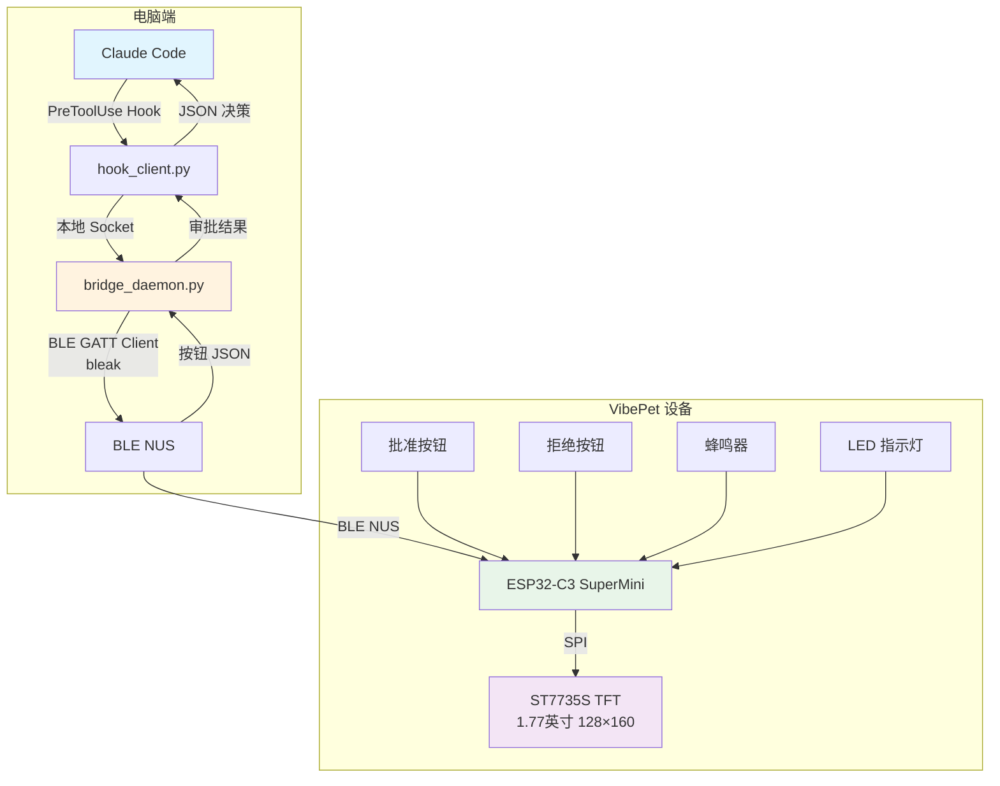
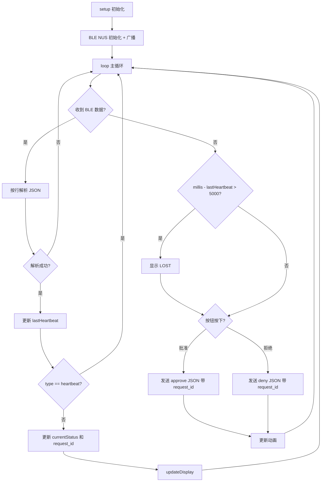
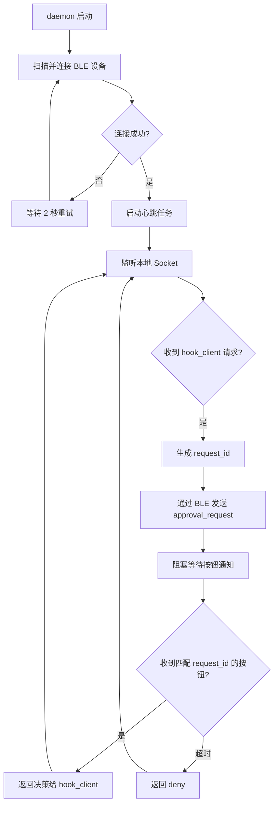

## 一、项目概述

### 1.1 项目名称

**VibePet —— AI 编程助手物理状态显示与审批终端（无线 BLE 版）**

### 1.2 项目背景

Claude Code、Codex CLI 等 AI 编程助手正快速进入开发者工作流。然而，这些工具的状态反馈完全依赖终端窗口——用户必须频繁切换到终端查看 AI 是否完成工作、是否正在等待审批。尤其在 AI 需要批准敏感操作（如执行 `rm` 命令）时，用户需要紧盯屏幕并手动输入确认。

本项目打造一个放在桌面上的实体小设备，通过 BLE 无线连接电脑，实时显示 AI 编程助手的工作状态，并提供物理按钮完成 approve / deny 审批，让开发者从“盯终端”中解放出来。

### 1.3 项目目标

1. 通过 BLE Nordic UART Service（NUS）无线接收 Claude Code 的状态事件，在 1.77 英寸 TFT 屏幕（128×160）上显示六种状态提示效果：空闲、工作中、等待审批、完成、出错、失联。
2. 当 AI 发起敏感操作审批请求时，屏幕弹出审批卡，用户按下物理按钮完成 approve / deny，决策通过 BLE 回传给电脑端。
3. 具备看门狗失联检测机制，设备不会冻结在过期状态。
4. 电脑端采用常驻守护进程（daemon）管理 BLE 连接、心跳和按钮通知；Claude Code Hook 通过本地 IPC 与 daemon 通信，阻塞等待审批结果。
5. 引入 `request_id` 机制，确保按钮决策与当前审批请求一一对应，避免迟到按钮误批准。

### 1.4 创新点与竞赛亮点

- **AI Agent 与嵌入式硬件的无线联动**：将 AI 编程助手的 Hook 机制与 BLE 硬件结合，实现“物理审批”交互范式。
- **BLE NUS 透明串口通道**：采用 Nordic UART Service 标准协议，在 BLE 之上承载 JSON Lines 数据，保持与串口一致的协议格式。
- **阻塞式审批 + 超时降级**：审批监听阻塞等待决定，超时自动拒绝，保证安全性。
- **看门狗失联保护**：设备永远不会冻结在过期状态，心跳超时后自动切换到失联显示。
- **六种状态提示效果**：为每种状态设计不同的颜色、文字和简单动画，提升桌面交互体验。
- **request_id 匹配机制**：按钮回传携带请求编号，电脑端只接受当前等待中的请求，避免误批准。
- **跨平台 BLE 客户端**：电脑端使用 Python `bleak` 库，支持 macOS / Windows / Linux。

## 二、需求分析

### 2.1 功能需求

| 编号 | 功能 | 描述 | 优先级 |
|---|---|---|---|
| F1 | 六种状态显示 | 屏幕显示空闲、工作中、等待审批、完成、出错、失联六种状态，每种有对应的颜色、文字和简单动画 | 高 |
| F2 | 审批提示 | AI 发起敏感操作审批请求时，屏幕弹出审批卡，显示工具名称和命令摘要 | 高 |
| F3 | 物理审批 | 用户按下“批准”或“拒绝”按钮，设备通过 BLE 回传带 `request_id` 的决策 | 高 |
| F4 | 超时降级 | 审批等待超过设定时间（默认 120 秒），自动返回“拒绝” | 高 |
| F5 | 心跳检测 | 电脑端 daemon 每秒发送心跳包，ESP32 超时未收到则显示“失联” | 中 |
| F6 | 蜂鸣器提醒 | 进入“等待审批”状态时，蜂鸣器发出短促提示音 | 中 |
| F7 | BLE 连接管理 | daemon 自动重连，设备端 LED 指示连接状态 | 高 |
| F8 | request_id 匹配 | 按钮回传携带 `request_id`，电脑端只接受当前等待中的请求 | 高 |
| F9 | 单审批队列 | 同一时间只处理一个审批请求，简化第一版实现 | 中 |

### 2.2 性能指标

| 指标 | 目标值 | 说明 |
|---|---|---|
| 状态刷新延迟 | ≤ 300 ms | 从 daemon 通过 BLE 发送到屏幕更新完成，待实测 |
| 按钮响应延迟 | ≤ 150 ms | 从按钮按下到 BLE 发出通知，待实测 |
| BLE 连接建立时间 | ≤ 5 s | 从设备上电广播到 daemon 连接成功，待实测 |
| BLE 有效通信距离 | ≥ 10 m | 板载天线典型值，待实测 |
| 审批超时时间 | 120 s（可配置） | 超时后自动拒绝 |
| 心跳超时时间 | 5 s（可配置） | 超时后进入失联显示 |
| 连续工作稳定性 | ≥ 8 小时（USB 供电） | 待实测 |

### 2.3 约束条件

| 约束项 | 要求 |
|---|---|
| 成本 | 核心 BOM ≤ ¥100（不含外壳和 3D 打印费用） |
| 尺寸 | 设备主体尺寸待定 —— 因屏幕升级为 1.77"，原约束 ≤ 80 mm × 50 mm × 25 mm 已放宽；需按实际采购模块外形实测后填写 |
| 供电 | 第一版使用 USB 5V 供电；电池供电作为可选加分项 |
| 通信方式 | BLE 5.0，Nordic UART Service（NUS） |
| 开发环境 | Arduino IDE 或 PlatformIO，ESP32 Arduino Core ≥ 3.0 |

## 三、系统总体设计

### 3.1 硬件架构框图



**工作流**：Claude Code 触发 `PreToolUse` Hook → 调用 `hook_client.py` → 客户端通过本地 Socket 向常驻 `bridge_daemon.py` 发送审批请求 → daemon 通过 BLE NUS 向 ESP32 发送状态和 `request_id` → 屏幕显示审批卡 + 蜂鸣器提示 → 用户按按钮 → ESP32 通过 BLE 回传带 `request_id` 的按钮 JSON → daemon 校验 `request_id` 后，将决策返回给 `hook_client.py` → 客户端输出 `allow` / `deny` JSON 给 Claude Code。

### 3.2 软件架构框图

```
┌─────────────────────────────────────────────────────────┐
│                    电脑端（Python）                      │
│  ┌───────────────┐        ┌───────────────────────────┐ │
│  │ hook_client.py│◄──────►│ bridge_daemon.py          │ │
│  │ (短生命周期)   │ Socket │ (常驻进程)                │ │
│  └───────────────┘        │  ┌─────────────────────┐  │ │
│         │                 │  │ BLE 连接管理         │  │ │
│         │                 │  │ 心跳发送             │  │ │
│         ▼                 │  │ 按钮通知接收         │  │ │
│  ┌───────────────┐        │  │ request_id 校验      │  │ │
│  │ Claude Code   │        │  │ 审批等待队列         │  │ │
│  │ Hook 输出     │        │  └─────────────────────┘  │ │
│  └───────────────┘        └───────────────────────────┘ │
└─────────────────────────────────────────────────────────┘
                          │ BLE NUS
┌─────────────────────────────────────────────────────────┐
│                  ESP32-C3 固件（Arduino）                │
│  ┌───────────┐  ┌───────────┐  ┌───────────────────┐   │
│  │ BLE 接收   │→│ JSON解析   │→│ 显示驱动层         │   │
│  │ (NUS RX)   │  │(ArduinoJson)│ │ (TFT_eSPI)        │   │
│  └───────────┘  └───────────┘  └───────────────────┘   │
│  ┌───────────┐  ┌───────────┐  ┌───────────────────┐   │
│  │ 按钮扫描   │→│ 去抖+JSON  │→│ BLE 发送层         │   │
│  │(digitalRead)│ │ 封装       │  │ (NUS TX notify)   │   │
│  └───────────┘  └───────────┘  └───────────────────┘   │
│  ┌───────────┐  ┌───────────┐                          │
│  │ 看门狗     │  │ BLE 连接   │                          │
│  │(millis计时)│  │ 状态管理   │                          │
│  └───────────┘  └───────────┘                          │
└─────────────────────────────────────────────────────────┘
```

### 3.3 通信方式与协议

采用 **BLE Nordic UART Service（NUS）** 作为透明串口通道，承载 **JSON Lines** 格式数据，每条消息以 `\n` 结尾。

**NUS 标准 UUID**：

| 角色 | UUID | 说明 |
|---|---|---|
| Service UUID | `6E400001-B5A3-F393-E0A9-E50E24DCCA9E` | Nordic UART Service |
| RX Characteristic | `6E400002-B5A3-F393-E0A9-E50E24DCCA9E` | 电脑 → 设备（Write） |
| TX Characteristic | `6E400003-B5A3-F393-E0A9-E50E24DCCA9E` | 设备 → 电脑（Notify） |

**电脑 → 设备（通过 RX Characteristic 写入）**：

```json
{"type":"state","status":"working","msg":"正在分析代码..."}
{"type":"approval_request","request_id":"abc123","tool":"Bash","summary":"rm -rf /tmp/build"}
{"type":"state","status":"done","msg":"任务完成"}
{"type":"heartbeat","seq":12345}
```

**设备 → 电脑（通过 TX Characteristic 通知）**：

```json
{"type":"button","request_id":"abc123","action":"approve"}
{"type":"button","request_id":"abc123","action":"deny"}
```

**状态定义**：

| 状态值 | 含义 | 显示颜色 | 屏幕效果 |
|---|---|---|---|
| `idle` | 空闲 | 白色 | 呼吸圆点 + “IDLE” |
| `working` | 工作中 | 绿色 | 旋转方块 + “WORKING” |
| `needs_you` | 等待审批 | 黄色 | 闪烁边框 + “APPROVE?” + 命令摘要 |
| `done` | 完成 | 青色 | 对勾图标 + “DONE” |
| `error` | 出错 | 红色 | 叉号 + “ERROR” + 错误信息 |
| `heartbeat_lost` | 失联 | 橙色 | “LOST” 大字 |

**行长与编码约定（两端硬契约）**：

- 每条消息一行，以 `\n` 结尾；接收端必须按 `\n` 重组（BLE 分片是常态，MTU 185）。
- 整行 UTF-8 编码后**不得超过 512 字节**（固件 `LINE_MAX`）。超长行由设备端**整条丢弃**（丢弃到行尾复位，不会把半截报文当消息处理）。
- 电脑端据此限制单字段（`summary` / `msg`）≤ **240 字节**，且截断必须落在 UTF-8 字符边界上（daemon 的 `clamp_bytes()`），保证中文摘要不超限、不被截成乱码。
- 电脑端只发 `idle` / `working` / `done` / `error` 四种 `status`；`needs_you` 由 `approval_request` 触发、`heartbeat_lost` 由设备端看门狗自行判断，都不出现在 `state` 消息里。

## 四、硬件设计与选型

### 4.1 主控芯片

| 项目 | 内容 |
|---|---|
| **推荐型号** | ESP32-C3 SuperMini |
| **替代方案** | ESP32-C3-Zero（微雪）/ Seeed XIAO ESP32-C3 |
| **选型理由** | ① 原生支持 BLE 5.0，内置射频前端；② 160 MHz RISC-V，400 KB SRAM，足以运行 BLE 协议栈 + TFT 驱动 + JSON 解析；③ 体积小巧，价格约 ¥15 |
| **关键参数** | 160 MHz RISC-V，400 KB SRAM，4 MB Flash，Wi-Fi + BLE 5.0 |

**BLE 配置要点**：推荐使用 **NimBLE-Arduino** 库代替原生 BLE 库，降低 RAM 和 Flash 占用。

### 4.2 显示屏

| 项目 | 内容 |
|---|---|
| **推荐型号** | 1.77" ST7735S TFT SPI（128×160） |
| **替代方案** | 1.44" ST7735S SPI（128×128）/ 0.96" ST7735 SPI（80×160）/ 1.8" ST7735 SPI（128×160） |
| **选型理由** | SPI 接口接线简单，TFT_eSPI 支持完善；128×160 较原 0.96" 方案的 80×160 横向多出 48 像素，审批卡可以多显示约两行摘要（摘要仍设长度上限，见 3.3 节约定） |
| **中文字体** | U8g2_for_TFT_eSPI + U8g2 的 `wqy12_t_gb2312`（文泉驿点阵宋体 12px，覆盖完整 GB2312，约 7550 字）。字体数据约 200 KB，分区必须为 Huge APP (3MB) |
| **驱动库** | TFT_eSPI（Bodmer 版）。`User_Setup.h` 需选 `ST7735_DRIVER` 并将分辨率设为 128×160；不同厂商 1.77" 模块的初始化序列（`ST7735_INITB` / `ST7735_GREENTAB` 等）存在差异，须按实际模块实测确定 |
| **参考价** | 待按实际采购模块核实（原 0.96" 方案约 ¥15） |

> **画布尺寸提示**：分辨率由 80×160 变为 128×160 后，`tft.setRotation(1)` 得到的横屏画布为 **160×128**（原为 160×80）。5.5 节示例代码中的 `setCursor()` 坐标是按旧画布书写的，在新分辨率下不会居中（竖向明显偏上），实现时须按新画布重新计算居中位置。接线引脚定义不变，ST7735S 与 ST7735 在本项目所用 SPI 接法上引脚兼容。

> **中文显示**：TFT_eSPI 内置字体只有 ASCII 字形。正文（命令摘要 / 错误信息 / 状态副标题）用上表的 wqy12 字体渲染，中文可读；标题类大字（IDLE / WORKING / APPROVE? 等）仍是内置 GLCD，两种字体混排。旧版固件曾把中文替换为 `?`（`sanitizeAscii()`），现已移除。

**接线参考（避开启动相关引脚）**：

| ST7735S 引脚 | ESP32-C3 GPIO | 说明 |
|---|---|---|
| VCC | 3.3V | 屏幕电源 |
| GND | GND | 公共地 |
| CS | GPIO 7 | 片选 |
| SDA (MOSI) | GPIO 6 | 数据 |
| SCK | GPIO 4 | 时钟 |
| A0 (DC) | GPIO 8 | 数据/命令切换 |
| RES | GPIO 5 | 复位 |
| LED | 3.3V | 背光 |

### 4.3 按钮与蜂鸣器

| 模块 | 推荐型号 | 接口 | 选型理由 |
|---|---|---|---|
| 批准按钮 | 6×6 mm 微动开关 | GPIO 1 | 避开启动引脚 GPIO9，启用 `INPUT_PULLUP` |
| 拒绝按钮 | 6×6 mm 微动开关 | GPIO 10 | 启用 `INPUT_PULLUP` |
| 蜂鸣器 | 3 针低电平触发无源蜂鸣器 | GPIO 3 | 低电平触发，成本约 ¥5 |
| LED 指示灯 | 3mm LED + 限流电阻 | GPIO 2 | BLE 连接状态指示 |

**引脚确认表（务必实测）**：

| 测试项 | 预期结果 |
|---|---|
| 正常上电启动 | 设备正常广播，屏幕显示 IDLE |
| 按住批准按钮上电 | 仍能正常启动，不进入下载模式 |
| USB 下载固件 | 不受按钮状态影响 |

### 4.4 电源方案

**第一版：USB 供电**

通过 USB-C 数据线从电脑取电，工作电压 5V，ESP32-C3 内部稳压至 3.3V。典型工作电流约 56~64 mA（BLE 活跃）。USB 线必须支持数据传输。

**可选加分项：锂电池供电**

若时间充裕，可增加 3.7V 锂电池 + TP4056 充电模块。注意：锂电池应接到 ESP32-C3 开发板的 5V 或 VBUS 输入脚（经板载 LDO 稳压），**不要直接接到 3.3V 引脚**。TP4056 不擅长边充边用，建议充电时关闭设备或使用带负载共享的充电模块。

### 4.5 外围电路要点

- **去耦电容**：3.3V 引脚旁放置 100 nF 和 10 µF 电容。
- **BLE 天线净空**：天线区域避免金属遮挡，电池远离天线。
- **按钮去抖**：软件时间戳去抖 + 硬件并联 100 nF 电容（可选）。
- **下载模式**：如遇自动下载失败，按住板载 BOOT 键再连接 USB。

### 4.6 硬件清单与成本

| 模块 | 推荐型号 | 用途 | 参考价 |
|---|---|---|---|
| 主控 | ESP32-C3 SuperMini | 核心，BLE + 显示控制 | ¥15 |
| 显示屏 | 1.77" ST7735S TFT（128×160） | 六种状态 + 审批卡 | 待核实 |
| 按钮 | 6×6mm 微动开关 ×2 | 批准 / 拒绝 | ¥2 |
| 蜂鸣器 | 无源蜂鸣器 | 审批提醒音 | ¥5 |
| LED | 3mm LED + 电阻 | BLE 状态指示 | ¥1 |
| 连接 | 杜邦线 + 面包板 | 接线调试 | ¥10 |
| 数据线 | USB-C（支持数据传输） | 供电 + 调试 | 自备 |
| **合计** | | | **待核实**（原 0.96" 方案约 ¥48~60，换屏后需按实际采购价重算） |

## 五、软件设计与实现

### 5.1 开发环境与工具链

| 项目 | 工具 |
|---|---|
| 嵌入式开发 | Arduino IDE ≥ 2.3 或 VS Code + PlatformIO |
| ESP32 核心库 | ESP32 Arduino Core ≥ 3.0 |
| BLE 库 | NimBLE-Arduino |
| TFT 驱动库 | TFT_eSPI（Bodmer 版） |
| JSON 库 | ArduinoJson（v6） |
| 电脑端开发 | Python ≥ 3.9 + bleak + asyncio |
| 电脑端平台 | macOS / Windows / Linux |

**Arduino IDE 关键配置**：
- 开发板：`ESP32C3 Dev Module`
- USB CDC On Boot：`Enabled`
- Partition Scheme：`Huge APP (3MB No OTA/1MB SPIFFS)`
- Flash Size：`4MB`
- Upload Speed：`921600`

### 5.2 模块划分与功能说明

**电脑端 bridge_daemon.py（常驻进程）**：

| 模块 | 功能 |
|---|---|
| `BleBridge` 类 | 管理 BLE 连接、发送状态、发送心跳、接收按钮通知 |
| `connect()` | 扫描并连接目标 BLE 设备，注册通知回调 |
| `send_state()` | 通过 NUS RX 写入状态 JSON |
| `send_approval_request()` | 发送带 `request_id` 的审批请求 |
| `send_heartbeat()` | 每秒发送心跳包 |
| `_on_notification()` | 解析按钮通知，校验 `request_id`，设置结果事件 |
| `wait_for_button()` | 异步阻塞等待按钮，超时返回 `deny` |
| `reconnect_loop()` | 断连后自动重连 |

**电脑端 hook_client.py（短生命周期）**：

| 模块 | 功能 |
|---|---|
| `main()` | 读取 Hook stdin JSON，通过本地 Socket 向 daemon 发送审批请求，等待结果，输出 `allow` / `deny` JSON |
| 异常兜底 | 连接失败、超时、解析失败时返回 `deny`，避免 Hook 崩溃 |

**ESP32 端 main_ble.ino**：

| 模块 | 功能 |
|---|---|
| `setup()` | 初始化 BLE NUS、GPIO、TFT |
| `loop()` | 主循环：看门狗检查、按钮扫描、动画更新 |
| `processLine()` | 解析 JSON，更新状态 |
| `updateDisplay()` | 根据状态绘制六种提示效果 |
| `checkWatchdog()` | 心跳超时切换失联显示 |
| `scanButtons()` | 去抖后通过 BLE 发送带 `request_id` 的按钮 JSON |
| `drawIdle()` / `drawWorking()` / `drawNeedsYou()` / `drawDone()` / `drawError()` / `drawLost()` | 六种状态绘制函数 |
| `beep()` | 蜂鸣器提示 |

### 5.3 主程序流程图

**ESP32 端**：



**电脑端 daemon**：



### 5.4 关键算法与逻辑说明

**（1）request_id 匹配机制**

daemon 为每次审批请求生成唯一 `request_id`（如 UUID 前 8 位），通过 BLE 发送给设备。设备在按钮回传时携带该 `request_id`。daemon 只接受当前等待中的 `request_id`，忽略迟到或过期的按钮事件，避免误批准。

**（2）看门狗失联检测**

ESP32 维护 `lastHeartbeat` 时间戳，每次收到 BLE 消息时更新。主循环检查 `millis() - lastHeartbeat > WATCHDOG_TIMEOUT`（默认 5000 ms），超时则切换到橙色 “LOST” 显示。daemon 每秒发送心跳包，确保超时前刷新。

进入 LOST 时设备会作废当前审批请求（清空 `request_id`），失联期间按键不再回传。**心跳恢复后的显示策略**：设备切回失联前的最后有效状态（`lastValidState`）；若那是 `needs_you`（审批卡），则改切 `idle` —— 该请求可能已被电脑端判超时，显示过期卡片会误导用户按下无效按钮。此外 daemon 在重连成功后会把当前应有的画面重新推给设备（审批进行中则重发审批卡、沿用原 `request_id`），作为设备端恢复的二次保险。

**（3）按钮去抖**

每个按钮维护 `lastPressTime`，当检测到 `digitalRead() == LOW` 且距上次按下超过 `DEBOUNCE_MS`（200 ms）时，才视为有效按下。

按下有效按钮后，设备**先本地切画面**（批准 → `working` + “已批准”；拒绝 → `idle` + “已拒绝”），同时作废 `request_id`，等电脑端后续状态覆盖。脱离 APPROVE? 不依赖电脑端回话，BLE 抖动时不会卡住，长按也不会重复发送。

**（4）阻塞式审批等待**

daemon 的 `wait_for_button()` 使用 `asyncio.Event` 实现异步阻塞，默认超时 120 秒，超时返回 `deny`。hook_client.py 通过本地 Socket 阻塞等待 daemon 的决策结果。

**（5）六种状态提示效果**

- `idle`：白色呼吸圆点，半径随时间正弦变化。
- `working`：绿色旋转方块，角度随时间递增。
- `needs_you`：黄色边框闪烁，每 500 ms 切换边框颜色；显示命令摘要。
- `done`：青色对勾图标，静态显示。
- `error`：红色叉号，静态显示；显示错误信息。
- `heartbeat_lost`：橙色背景，黑色 “LOST” 大字。

### 5.5 核心代码片段

**（1）电脑端 bridge_daemon.py（核心逻辑）**

```python
import asyncio, json, time, sys, uuid
from bleak import BleakScanner, BleakClient

DEVICE_NAME = "VibePet"
NUS_RX_UUID = "6E400002-B5A3-F393-E0A9-E50E24DCCA9E"
NUS_TX_UUID = "6E400003-B5A3-F393-E0A9-E50E24DCCA9E"
HEARTBEAT_INTERVAL = 1.0
APPROVAL_TIMEOUT = 120


class BleBridge:
    def __init__(self):
        self.client = None
        self.button_event = asyncio.Event()
        self.button_action = None
        self.current_request_id = None
        self.rx_buffer = ""
        self.last_heartbeat = time.time()

    async def connect(self):
        while True:
            try:
                devices = await BleakScanner.discover(timeout=5.0)
                target = next((d for d in devices if d.name and DEVICE_NAME in d.name), None)
                if target:
                    self.client = BleakClient(target.address)
                    await self.client.connect()
                    await self.client.start_notify(NUS_TX_UUID, self._on_notification)
                    print(f"已连接: {target.name}", file=sys.stderr)
                    return
            except Exception as e:
                print(f"连接失败: {e}", file=sys.stderr)
            await asyncio.sleep(2)

    def _on_notification(self, sender, data):
        self.rx_buffer += data.decode("utf-8", errors="ignore")
        while "\n" in self.rx_buffer:
            line, self.rx_buffer = self.rx_buffer.split("\n", 1)
            line = line.strip()
            if not line:
                continue
            try:
                msg = json.loads(line)
                if msg.get("type") == "button":
                    if msg.get("request_id") == self.current_request_id:
                        self.button_action = msg["action"]
                        self.button_event.set()
            except json.JSONDecodeError:
                continue

    async def send_state(self, status, msg=""):
        payload = json.dumps({"type": "state", "status": status, "msg": msg},
                             ensure_ascii=False) + "\n"
        await self.client.write_gatt_char(NUS_RX_UUID, payload.encode("utf-8"))

    async def send_approval_request(self, request_id, tool, summary):
        payload = json.dumps({
            "type": "approval_request",
            "request_id": request_id,
            "tool": tool,
            "summary": summary
        }, ensure_ascii=False) + "\n"
        await self.client.write_gatt_char(NUS_RX_UUID, payload.encode("utf-8"))

    async def send_heartbeat(self):
        if time.time() - self.last_heartbeat >= HEARTBEAT_INTERVAL:
            payload = json.dumps({"type": "heartbeat", "seq": int(time.time())}) + "\n"
            await self.client.write_gatt_char(NUS_RX_UUID, payload.encode("utf-8"))
            self.last_heartbeat = time.time()

    async def wait_for_button(self, request_id, timeout=APPROVAL_TIMEOUT):
        self.current_request_id = request_id
        self.button_event.clear()
        start = time.time()
        while time.time() - start < timeout:
            await self.send_heartbeat()
            try:
                await asyncio.wait_for(self.button_event.wait(), timeout=1.0)
                return self.button_action
            except asyncio.TimeoutError:
                continue
        return "deny"

    async def heartbeat_loop(self):
        while True:
            await self.send_heartbeat()
            await asyncio.sleep(1.0)


async def handle_hook_request(bridge, reader, writer):
    data = await reader.read(4096)
    req = json.loads(data.decode("utf-8"))
    tool_name = req.get("tool_name", "")
    tool_input = req.get("tool_input", {})
    detail = str(tool_input.get("command", tool_input))[:60]
    request_id = str(uuid.uuid4())[:8]

    await bridge.send_approval_request(request_id, tool_name, detail)
    action = await bridge.wait_for_button(request_id)

    resp = {"action": action}
    writer.write(json.dumps(resp).encode("utf-8"))
    await writer.drain()
    writer.close()


async def main():
    bridge = BleBridge()
    await bridge.connect()
    asyncio.create_task(bridge.heartbeat_loop())

    server = await asyncio.start_server(
        lambda r, w: handle_hook_request(bridge, r, w), "127.0.0.1", 8765)
    async with server:
        await server.serve_forever()


if __name__ == "__main__":
    asyncio.run(main())
```

**（2）电脑端 hook_client.py**

```python
import json, socket, sys

def main():
    hook_input = json.loads(sys.stdin.read())
    try:
        sock = socket.socket(socket.AF_INET, socket.SOCK_STREAM)
        sock.connect(("127.0.0.1", 8765))
        sock.sendall(json.dumps(hook_input).encode("utf-8"))
        resp = sock.recv(4096)
        action = json.loads(resp.decode("utf-8"))["action"]
    except Exception as e:
        print(f"daemon 通信失败: {e}", file=sys.stderr)
        action = "deny"

    if action == "approve":
        result = {
            "hookSpecificOutput": {
                "hookEventName": "PreToolUse",
                "permissionDecision": "allow",
                "permissionDecisionReason": "Approved by VibePet",
            }
        }
    else:
        result = {
            "hookSpecificOutput": {
                "hookEventName": "PreToolUse",
                "permissionDecision": "deny",
                "permissionDecisionReason": "Denied by VibePet",
            }
        }
    print(json.dumps(result))

if __name__ == "__main__":
    main()
```

**（3）ESP32 端 main_ble.ino（核心逻辑）**

```cpp
#include <ArduinoJson.h>
#include <TFT_eSPI.h>
#include <NimBLEDevice.h>

#define BTN_APPROVE  1
#define BTN_DENY     10
#define BUZZER       3
#define LED_STATUS   2

#define NUS_SERVICE_UUID "6E400001-B5A3-F393-E0A9-E50E24DCCA9E"
#define NUS_RX_UUID      "6E400002-B5A3-F393-E0A9-E50E24DCCA9E"
#define NUS_TX_UUID      "6E400003-B5A3-F393-E0A9-E50E24DCCA9E"

const unsigned long WATCHDOG_TIMEOUT = 5000;
const unsigned long DEBOUNCE_MS       = 200;

TFT_eSPI tft = TFT_eSPI();
NimBLEServer* pServer = nullptr;
NimBLECharacteristic* pTxChar = nullptr;
bool bleConnected = false;
String rxBuffer = "";
unsigned long lastHeartbeat = 0;
unsigned long btnApproveTime = 0;
unsigned long btnDenyTime    = 0;
String currentStatus = "idle";
String currentRequestId = "";
unsigned long lastAnim = 0;

class ServerCallbacks : public NimBLEServerCallbacks {
  void onConnect(NimBLEServer*) override {
    bleConnected = true;
    digitalWrite(LED_STATUS, HIGH);
  }
  void onDisconnect(NimBLEServer*) override {
    bleConnected = false;
    digitalWrite(LED_STATUS, LOW);
    NimBLEDevice::startAdvertising();
  }
};

class RxCallbacks : public NimBLECharacteristicCallbacks {
  void onWrite(NimBLECharacteristic* pChar) override {
    std::string value = pChar->getValue();
    for (char c : value) {
      if (c == '\n') {
        processLine(rxBuffer);
        rxBuffer = "";
      } else {
        rxBuffer += c;
        if (rxBuffer.length() > 512) rxBuffer = "";
      }
    }
  }
};

void setup() {
  Serial.begin(115200);
  pinMode(BTN_APPROVE, INPUT_PULLUP);
  pinMode(BTN_DENY,    INPUT_PULLUP);
  pinMode(BUZZER,      OUTPUT);
  pinMode(LED_STATUS,  OUTPUT);
  digitalWrite(BUZZER, HIGH);

  tft.init();
  tft.setRotation(1);
  tft.fillScreen(TFT_BLACK);
  drawIdle();

  NimBLEDevice::init("VibePet");
  NimBLEDevice::setMTU(185);
  pServer = NimBLEDevice::createServer();
  pServer->setCallbacks(new ServerCallbacks());
  NimBLEService* pService = pServer->createService(NUS_SERVICE_UUID);
  NimBLECharacteristic* pRxChar = pService->createCharacteristic(
    NUS_RX_UUID, NIMBLE_PROPERTY::WRITE | NIMBLE_PROPERTY::WRITE_NR);
  pRxChar->setCallbacks(new RxCallbacks());
  pTxChar = pService->createCharacteristic(NUS_TX_UUID, NIMBLE_PROPERTY::NOTIFY);
  pService->start();
  NimBLEAdvertising* pAdvertising = NimBLEDevice::getAdvertising();
  pAdvertising->addServiceUUID(NUS_SERVICE_UUID);
  pAdvertising->setName("VibePet");
  pAdvertising->start();

  lastHeartbeat = millis();
}

void loop() {
  if (millis() - lastHeartbeat > WATCHDOG_TIMEOUT) {
    static bool lostShown = false;
    if (!lostShown) {
      drawLost();
      lostShown = true;
    }
  }

  if (digitalRead(BTN_APPROVE) == LOW && millis() - btnApproveTime > DEBOUNCE_MS) {
    btnApproveTime = millis();
    sendButton("approve");
    beep(1);
  }
  if (digitalRead(BTN_DENY) == LOW && millis() - btnDenyTime > DEBOUNCE_MS) {
    btnDenyTime = millis();
    sendButton("deny");
    beep(2);
  }

  // 动画更新
  if (millis() - lastAnim > 100) {
    lastAnim = millis();
    updateAnimation();
  }
  delay(10);
}

void processLine(const String& line) {
  StaticJsonDocument<512> doc;
  if (deserializeJson(doc, line) != DeserializationError::Ok) return;
  lastHeartbeat = millis();
  const char* type = doc["type"];
  if (!type) return;
  if (strcmp(type, "heartbeat") == 0) return;

  if (strcmp(type, "state") == 0) {
    const char* status = doc["status"];
    const char* msg = doc["msg"] | "";
    currentStatus = String(status);
    updateDisplay(status, msg);
  } else if (strcmp(type, "approval_request") == 0) {
    currentRequestId = String(doc["request_id"].as<const char*>());
    const char* tool = doc["tool"];
    const char* summary = doc["summary"];
    currentStatus = "needs_you";
    updateDisplay("needs_you", summary);
    beep(3);
  }
}

void sendButton(const char* action) {
  if (!bleConnected || !pTxChar) return;
  StaticJsonDocument<128> doc;
  doc["type"] = "button";
  doc["request_id"] = currentRequestId;
  doc["action"] = action;
  String payload;
  serializeJson(doc, payload);
  payload += "\n";
  pTxChar->setValue((uint8_t*)payload.c_str(), payload.length());
  pTxChar->notify();
}

void updateDisplay(const char* status, const char* msg) {
  tft.fillScreen(TFT_BLACK);
  if (strcmp(status, "idle") == 0) drawIdle();
  else if (strcmp(status, "working") == 0) drawWorking();
  else if (strcmp(status, "needs_you") == 0) drawNeedsYou(msg);
  else if (strcmp(status, "done") == 0) drawDone();
  else if (strcmp(status, "error") == 0) drawError(msg);
}

void drawIdle() {
  tft.fillScreen(TFT_BLACK);
  tft.setTextColor(TFT_WHITE);
  tft.setTextSize(2);
  tft.setCursor(10, 60);
  tft.print("IDLE");
}

void drawWorking() {
  tft.fillScreen(TFT_BLACK);
  tft.setTextColor(TFT_GREEN);
  tft.setTextSize(2);
  tft.setCursor(10, 60);
  tft.print("WORKING");
}

void drawNeedsYou(const char* msg) {
  tft.fillScreen(TFT_BLACK);
  tft.setTextColor(TFT_YELLOW);
  tft.setTextSize(2);
  tft.setCursor(10, 10);
  tft.print("APPROVE?");
  tft.setTextSize(1);
  tft.setTextColor(TFT_WHITE);
  tft.setCursor(10, 45);
  tft.print(msg);
}

void drawDone() {
  tft.fillScreen(TFT_BLACK);
  tft.setTextColor(TFT_CYAN);
  tft.setTextSize(2);
  tft.setCursor(10, 60);
  tft.print("DONE");
}

void drawError(const char* msg) {
  tft.fillScreen(TFT_BLACK);
  tft.setTextColor(TFT_RED);
  tft.setTextSize(2);
  tft.setCursor(10, 10);
  tft.print("ERROR");
  tft.setTextSize(1);
  tft.setCursor(10, 45);
  tft.print(msg);
}

void drawLost() {
  tft.fillScreen(TFT_ORANGE);
  tft.setTextColor(TFT_BLACK);
  tft.setTextSize(3);
  tft.setCursor(20, 55);
  tft.print("LOST");
}

void updateAnimation() {
  // 可根据 currentStatus 实现简单动画，如呼吸圆点、旋转方块、闪烁边框
  // 此处略，详见完整代码
}

void beep(int times) {
  for (int i = 0; i < times; i++) {
    digitalWrite(BUZZER, LOW);
    delay(50);
    digitalWrite(BUZZER, HIGH);
    delay(50);
  }
}
```

### 5.6 中断/任务调度策略

ESP32 端采用**主循环轮询 + BLE 回调**模式。BLE 数据接收在 NimBLE 回调中完成，主循环负责看门狗、按钮扫描和动画更新。按钮扫描周期约 10 ms，远小于人类按键持续时间，不会漏检。如需更高实时性，可将按钮改为 GPIO 中断 + FreeRTOS 队列。

电脑端 daemon 使用 `asyncio` 实现并发：BLE 心跳、本地 Socket 服务器、审批等待协程并行运行。

## 六、开发计划

### 6.1 阶段划分与时间估算

| 阶段 | 内容 | 时间 | 交付物 |
|---|---|---|---|
| **阶段一：硬件搭建与驱动调试** | 面包板接线、TFT 点亮、按钮和蜂鸣器测试 | 1 周 | 可运行硬件原型 |
| **阶段二：BLE 通信基础** | ESP32 BLE NUS 服务、nRF Connect 验证收发 | 1 周 | BLE 双向通信打通 |
| **阶段三：ESP32 固件开发** | JSON 解析、六种状态显示、看门狗、按钮去抖 | 1 周 | 完整固件 |
| **阶段四：电脑端 daemon 开发** | bleak 异步连接、心跳、request_id 匹配、本地 Socket | 1 周 | daemon 可独立测试 |
| **阶段五：Hook 集成与联调** | hook_client.py、Claude Code Hook 配置、端到端测试 | 1 周 | 完整闭环 |
| **阶段六：测试优化与文档** | 性能测试、稳定性测试、文档撰写 | 0.5 周 | 测试报告、项目文档 |

**总周期：5.5 周**（可压缩至 4 周或延长至 8 周）

### 6.2 里程碑

| 里程碑 | 标志 |
|---|---|
| M1 | TFT 屏幕点亮并显示文字 |
| M2 | nRF Connect 能发现 VibePet 并读写 NUS |
| M3 | ESP32 收到 JSON 后正确切换六种状态 |
| M4 | 按下按钮后 BLE 输出带 request_id 的 JSON |
| M5 | daemon 能连接设备、发送心跳、接收按钮 |
| M6 | Claude Code 端到端流程跑通：审批请求 → 物理按钮 → AI 继续执行 |

## 七、测试方案

### 7.1 单元测试

| 测试项 | 方法 | 预期结果 |
|---|---|---|
| TFT 显示 | 依次触发六种状态 | 屏幕正确显示对应颜色和文字 |
| BLE 广播 | nRF Connect 扫描 | 发现 “VibePet”，含 NUS 服务 |
| BLE 收发 | nRF Connect 写入 JSON | 屏幕切换状态；按钮回传通知 |
| request_id 匹配 | 发送两个不同 request_id 的审批请求，按旧按钮 | daemon 忽略旧 request_id |
| JSON 解析 | 发送非法 JSON | 不崩溃，忽略 |
| 蜂鸣器 | 触发 needs_you | 短促提示音 |
| 看门狗 | 停止心跳 5 秒 | 屏幕显示 LOST |

### 7.2 集成测试

| 测试项 | 方法 | 预期结果 |
|---|---|---|
| 端到端审批 | Claude Code 执行 `rm` 命令，按批准 | Claude Code 继续执行 |
| 拒绝审批 | 同上，按拒绝 | Claude Code 不执行命令 |
| 超时降级 | 触发审批后等待 120 秒 | 自动拒绝 |
| BLE 断连恢复 | 关闭蓝牙后重新打开 | daemon 自动重连 |
| 心跳失联 | 停止 daemon，等待 5 秒 | 屏幕显示 LOST |
| 迟到按钮 | 第一次审批超时后按批准 | 不影响下一次审批 |
| 设备重启恢复 | 重启 ESP32 | daemon 自动重新连接 |
| 按住按钮上电 | 按住批准键上电 | 设备正常启动，不进入下载模式 |

### 7.3 性能测试

| 指标 | 测试方法 | 目标值 |
|---|---|---|
| 状态刷新延迟 | 高速摄像机测量 | ≤ 300 ms（待实测） |
| 按钮响应延迟 | 逻辑分析仪测量 | ≤ 150 ms（待实测） |
| BLE 连接建立时间 | 从设备上电到 daemon 连接成功 | ≤ 5 s（待实测） |
| BLE 有效距离 | 逐步远离至断连 | ≥ 10 m（待实测） |
| 连续工作稳定性 | 连续运行 8 小时 | 无死机（待实测） |

### 7.4 测试记录表模板

| 测试日期 | 测试项 | 测试条件 | 预期结果 | 实际结果 | 是否通过 | 备注 |
|---|---|---|---|---|---|---|
| 2026-XX-XX | BLE 连接建立 | 设备上电 | ≤ 5 s | 待填 | ☐ | |
| 2026-XX-XX | 状态刷新延迟 | working → needs_you | ≤ 300 ms | 待填 | ☐ | |
| 2026-XX-XX | 按钮响应 | 按下批准 | ≤ 150 ms | 待填 | ☐ | |
| 2026-XX-XX | request_id 匹配 | 旧按钮事件 | 被忽略 | 待填 | ☐ | |
| 2026-XX-XX | 心跳失联 | 停止 daemon | 5 s 内显示 LOST | 待填 | ☐ | |
| 2026-XX-XX | 按住按钮上电 | 批准键按住上电 | 正常启动 | 待填 | ☐ | |
| 2026-XX-XX | 端到端审批 | rm 命令 | AI 继续执行 | 待填 | ☐ | |

## 八、风险分析与应对

### 8.1 技术风险

| 风险 | 概率 | 影响 | 应对措施 |
|---|---|---|---|
| BLE 连接不稳定 | 中 | 高 | 增大连接间隔；daemon 自动重连；天线净空 |
| BLE 数据分片导致解析失败 | 中 | 中 | 协商 MTU 至 185；接收端按 `\n` 重组 |
| Hook stdout 被日志污染 | 中 | 高 | 调试信息写 stderr；hook_client.py 只输出 JSON |
| 按钮误触发 | 中 | 低 | 时间戳去抖 + request_id 匹配 |
| GPIO 选择影响启动 | 中 | 高 | 避开 GPIO9 等启动引脚；实测按住按钮上电 |
| 电池方案不安全 | 中 | 高 | 第一版仅 USB 供电；电池作为可选加分项，正确接法 |
| JSON 解析内存溢出 | 低 | 高 | 使用 `JsonDocument`（ArduinoJson 7 动态池）；协议层限制整行 ≤512 字节、单字段 ≤240 字节 |
| 中文字库撑爆 Flash | 中 | 中 | wqy12 字库约 200 KB，分区固定 Huge APP (3MB)；编译后确认占用（实测 26%） |
| 审批后 / 失联恢复时屏幕卡在过期画面 | 中 | 中 | 按钮按下即本地切画面；LOST 恢复到最后有效状态（审批卡转 idle）；daemon 重连后补发当前状态 |

### 8.2 进度风险

| 风险 | 应对措施 |
|---|---|
| BLE 调试耗时超预期 | 先用 nRF Connect 验证，再写 Python |
| bleak 平台兼容性问题 | 优先在 macOS/Linux 开发，Windows 需 10 16299+ |
| Hook 集成权限问题 | 先命令行测试 daemon 和 hook_client，再接入 Hook |

### 8.3 应对措施汇总

1. **分步调试**：TFT → BLE 广播 → BLE 收发 → daemon → hook_client → Hook 集成。
2. **日志隔离**：所有调试信息写 stderr，stdout 只输出 Hook JSON。
3. **request_id 机制**：从第一版就引入，避免后期重构。
4. **USB 优先**：第一版不碰电池，降低风险。
5. **备份配置**：保存 Arduino IDE 配置和 TFT_eSPI 的 `User_Setup.h`。

## 九、竞赛/创意亮点总结

### 9.1 技术亮点

1. **AI Agent 与嵌入式硬件无线联动**：通过 BLE NUS 将 AI 编程助手工作流延伸到物理世界。
2. **BLE NUS 透明串口通道**：标准协议，JSON Lines 承载，代码迁移成本低。
3. **阻塞式审批 + 超时降级**：审批阻塞等待，超时自动拒绝，安全可靠。
4. **看门狗失联保护**：设备不会冻结在过期状态。
5. **request_id 匹配机制**：按钮决策与审批请求一一对应，避免误批准。
6. **六种状态提示效果**：每种状态有独特的颜色、文字和简单动画。
7. **跨平台 BLE 客户端**：Python `bleak` 支持 macOS / Windows / Linux。

### 9.2 应用价值

- **开发者效率提升**：物理按钮触觉反馈，无需盯终端。
- **AI 安全审批物理化**：更可靠、更不易误触的审批方式。
- **可复现性强**：BOM 约 ¥50，元器件常见，适合教学和竞赛。

### 9.3 可扩展方向

| 方向 | 说明 |
|---|---|
| 电池供电 | 第一版完成后可选加分项 |
| 多会话 FIFO 审批队列 | 参考 m5-paper-buddy，一次弹一个 |
| 更多动画 | 在六种状态基础上增加细节动画 |
| 外壳 3D 打印 | 提升产品化程度 |
| 手机 App 监控 | 通过 BLE 远程查看状态并审批 |
| 电磁铁触觉反馈 | 审批时短暂震动；MOSFET 需选逻辑电平型号（如 IRF540N 在 3.3V 下不完全导通，应选 2.5V 栅压下有明确导通电阻指标的型号） |

## 十、参考资料

### 10.1 核心开源项目

| 项目 | 链接 | 可借鉴的部分 |
|---|---|---|
| **clawd-on-desk** | github.com/rullerzhou-afk/clawd-on-desk | 三架构设计、event-to-state 映射、多会话聚合 |
| **clackclack** | github.com/ccmilu/clackclack | 有线方案参考、BOM、双向串口协议 |
| **claude-desktop-buddy（官方）** | github.com/anthropics/claude-desktop-buddy | BLE 参考实现，NUS UUID 和 JSON schema |
| **m5-paper-buddy** | github.com/op7418/m5-paper-buddy | 多会话 Dashboard、FIFO 审批队列 |
| **vibe-lamp** | github.com/laofahai/vibe-lamp | 状态归一化、看门狗失联逻辑 |
| **Arduino_BLESerial** | github.com/uutzinger/Arduino_BLESerial | NUS 服务端实现 |
| **arduino-ble-serial** | github.com/senseshift/arduino-ble-serial | 轻量级 NUS 实现 |

### 10.2 技术文档

- **Claude Code Hooks 官方文档**：`PreToolUse` 返回 `hookSpecificOutput.permissionDecision`，取值 `allow` / `deny` / `ask` / `defer`。
- **bleak 库文档**：bleak.readthedocs.io
- **NimBLE-Arduino**：github.com/h2zero/NimBLE-Arduino
- **Nordic UART Service 规范**：NUS Service UUID `6E400001-B5A3-F393-E0A9-E50E24DCCA9E`
- **TFT_eSPI 库**：Bodmer 版，通过 `User_Setup.h` 配置引脚

### 10.3 硬件数据手册

- ESP32-C3 数据手册（Espressif 官方）
- ST7735S 数据手册（Sitronix）
- ArduinoJson 库文档（arduinojson.org）
- TFT_eSPI 库文档（GitHub: Bodmer/TFT_eSPI）